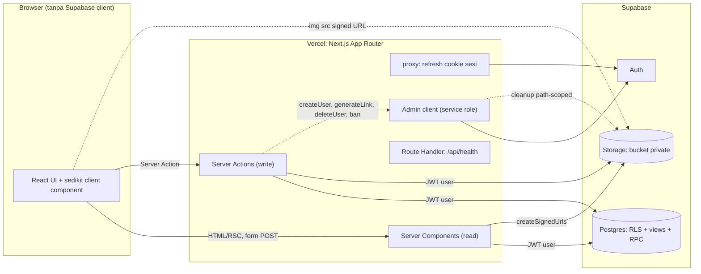
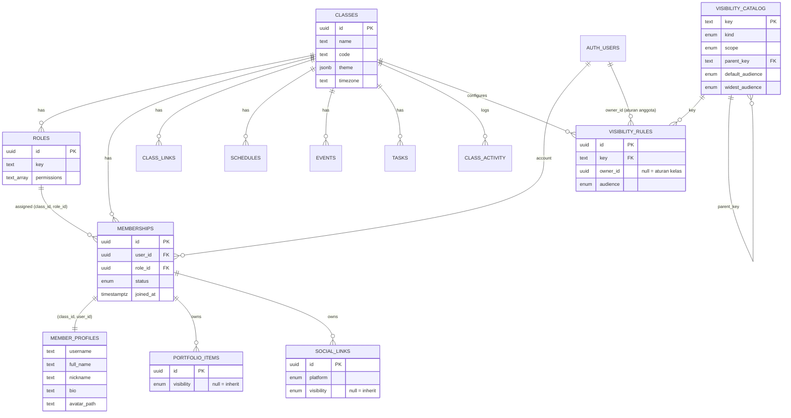
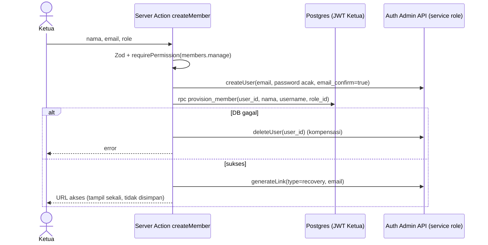
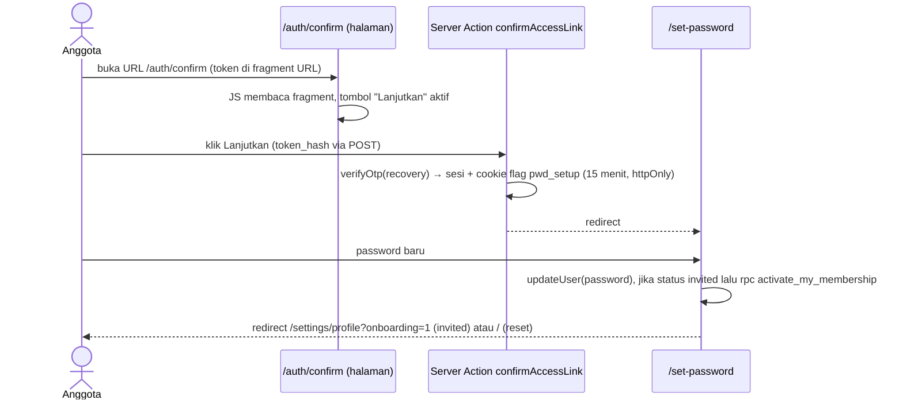
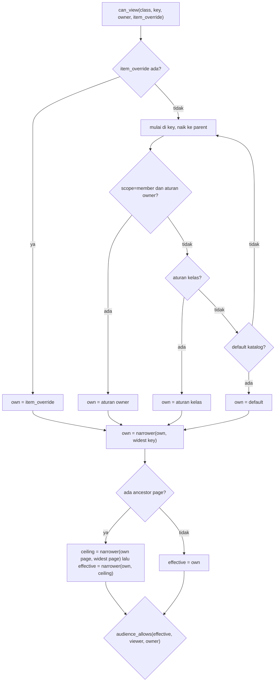

# blueprint.md — Eclipse (Sistem Kelas Mahasiswa)

| | |
|---|---|
| Kelas | **Eclipse** (satu kelas per deployment, ±20 anggota termasuk Ketua) |
| Nama kerja produk | ClassHub (nama repo/paket saja; UI memakai `classes.name`) |
| Stack | Next.js · Supabase (Postgres, Auth, Storage, RLS) · Vercel · free tier |
| Sumber kebenaran | PRD "Sistem Kelas Mahasiswa" + `AGENTS.md` (engineering) + `DESIGN.md` (aturan desain UI/UX) |
| Prioritas | correctness > maintainability > simplicity > visual sophistication |
| Bahasa | Dokumen: Indonesia. Kode/identifier: Inggris. Copy UI: Indonesia. |

---

## 0. Cara membaca & mengeksekusi dokumen ini

### 0.1 Urutan prioritas (mengikuti `AGENTS.md` §2)

1. Instruksi eksplisit pemilik produk: nama kelas **Eclipse**, requirement **Dynamic Visibility**, prioritas correctness.
2. PRD.
3. `AGENTS.md` dan `DESIGN.md`. PRD menyebut "AGENTS.md" saat membahas token, anti-slop, responsive, state, dan empty state; aturan-aturan itu ada di `DESIGN.md`. Keduanya mengikat.
4. Dokumen ini (turunan operasional dari 1–3). Bila bertentangan dengan 1–3, yang lebih tinggi menang dan konfliknya dicatat di `docs/STATUS.md`.
5. Konvensi codebase dan judgment.

### 0.2 Aturan eksekusi untuk AI coding agent

- Kerjakan per fase (§20). Tiap fase harus berakhir dalam kondisi yang bisa dibuild, dites, dan diverifikasi.
- **Jangan menambah fitur** di luar §1.3. Daftar yang sengaja tidak dibuat ada di §26.4.
- Contoh kode di dokumen ini adalah **intent**. Konfirmasi signature API paket terpasang (Next.js, `@supabase/ssr`, Tailwind, date-fns) dari dokumentasi/type definitions versi yang terpasang sebelum dipakai (`AGENTS.md` §3).
- Jangan edit manual file generated (`database.types.ts`, lockfile, output build).
- Temuan sementara, progres, dan gap dicatat di `docs/STATUS.md`, bukan di `AGENTS.md`.
- Laporan akhir tiap fase: hasil, file terdampak, verifikasi yang dijalankan (dan yang tidak), batasan, serta status lokal/remote (`AGENTS.md` §17).
- Jangan commit/push kecuali diminta.

### 0.3 Notasi

`WAJIB` = tidak boleh dilanggar. `DEFAULT` = standar, boleh menyimpang hanya dengan alasan tertulis. ID rujukan: `A-xx` asumsi, `V-xx` deviasi dari PRD, `D-xx` keputusan, `AC-<MODUL>-nn` acceptance criteria.

---

## 1. Ringkasan produk & lingkup

### 1.1 Apa yang dibangun

Web app yang menjadi **rumah digital sebuah kelas mahasiswa**: identitas kelas, anggota beserta profil/portofolio/social link, jadwal, event, tugas, dan dashboard ringkas. Bukan LMS, bukan sistem akademik, bukan platform chat/social media (PRD §4).

### 1.2 Pengguna

| Peran | Realisasi | Catatan |
|---|---|---|
| Visitor (anonim) | Tanpa login | Hanya melihat apa yang audience-nya `public` |
| Member | Membership aktif, role `member` | Kelola profil/portofolio/social/visibility milik sendiri |
| Ketua | Membership aktif, role `ketua` | Tetap member; hak admin = permission pada role (PRD §5) |

### 1.3 Lingkup MVP (in-scope)

| Modul | Isi | Rujukan PRD |
|---|---|---|
| Auth | Login email+password, aktivasi lewat tautan akses, ganti password | §16, §23 |
| Class identity | Profil kelas, highlight, link kelas, logo/cover, theme, layout preset | §9 |
| Members | Directory, profil, manajemen anggota oleh Ketua, role assignment | §10, §11 |
| Portfolio & social | CRUD milik sendiri, per-item visibility | §10 |
| Schedule | Jadwal kuliah + kegiatan, tampilan upcoming list (gabungan dengan event dan tenggat tugas) | §12 |
| Events | CRUD, daftar mendatang/lalu, detail | §13 |
| Tasks | CRUD, status, due-soon turunan, prioritas visual | §14 |
| Home | Identitas, upcoming, overview, activity trend, strip anggota | §7, §8 |
| **Dynamic Visibility** | Audience configurable untuk page, section, field, item | Requirement tambahan |

### 1.4 Deviasi dari PRD (wajib dibaca)

| ID | PRD | Blueprint | Alasan |
|---|---|---|---|
| V-01 | Public landing/profile = Phase 2 (§21) | Engine visibility dan default `public` untuk informasi non-sensitif ada di MVP. Yang public by default hanya identitas kelas; data personal anggota default `class_member` | Instruksi eksplisit pemilik produk (prioritas 1). SEO/share profile tetap Phase 2 (`noindex`, D-12) |
| V-02 | `dashboard/` dan landing terpisah | Satu route `/` yang menyesuaikan viewer (guest melihat identitas, member melihat dashboard) | IA PRD §6/§7 menaruh identitas kelas di dalam Home; satu halaman + per-section visibility menggantikan dua halaman |
| V-03 | `member/[username]` dan `members/` | `/members/[username]` | Satu namespace, konsisten |
| V-04 | Flow "Join Class" | Diganti undangan oleh Ketua; langkah join otomatis | Tidak ada self-signup (A-05) |
| V-05 | G4: Ketua mengelola "struktur role" | MVP hanya assign role; definisi role lewat migration | PRD §20 hanya Member+Ketua; skema siap role tambahan (§6) |
| V-06 | Tabel `users` | Tidak ada; `auth.users` + `member_profiles` | Hindari duplikasi identitas dan email di schema publik |
| V-07 | `member_profiles(user_id,…)` | Key `(class_id, user_id)` | RLS/visibility per kelas tanpa join |
| V-08 | Schedule berisi class schedule, activity, event, deadline | Tabel `schedules` (type `class`/`activity`); halaman Schedule menggabungkan `events` dan tenggat `tasks` secara read-only | Menghindari duplikasi data |
| V-09 | Calendar view | Ditunda (PRD §12: secondary) | MVP = upcoming list |

### 1.5 Asumsi tertulis

| ID | Asumsi |
|---|---|
| A-01 | Nama kelas tidak di-hard-code; selalu dari `classes.name` (seed: `Eclipse`). |
| A-02 | Satu kelas per deployment, **ditegakkan DB** (unique index konstan, §5.3). Semua tabel tetap membawa `class_id`. |
| A-03 | UI berbahasa Indonesia, tanpa library i18n. |
| A-04 | Timezone kelas default `Asia/Jakarta`; opsi `Asia/Jakarta`, `Asia/Makassar`, `Asia/Jayapura`. Ketua mengatur saat setup. |
| A-05 | Akun dibuat Ketua. Tidak ada self-signup. Tidak ada email delivery (free tier Supabase hanya mengirim email ke alamat tim tanpa SMTP kustom). Ketua menerima **tautan akses sekali pakai** dan membagikannya sendiri (WhatsApp dsb.). |
| A-06 | "Lupa password" = Ketua menerbitkan tautan akses baru. |
| A-07 | Definisi role tidak punya UI. Role dipilih dari tabel `roles`. |
| A-08 | "Kegiatan" (PRD §5) = `schedules.type='activity'`. "Deadline" di Schedule = turunan `tasks.deadline`. |
| A-09 | "Due Soon" bukan status tersimpan. Tersimpan: `active|completed|archived`. Due soon = `active` dengan `deadline <= now + 72 jam` (termasuk yang sudah lewat, berlabel "Lewat tenggat"). |
| A-10 | "Featured content" = satu sorotan teks + link opsional (`highlight_text`, `highlight_url`). |
| A-11 | Layout preset awal: `standard`, `profile_focused`. `editorial` ditunda. |
| A-12 | "Preview → Publish" theme: preview = state lokal tanpa simpan; Publish = simpan. Tidak ada draft tersimpan. |
| A-13 | `tasks.target` = label teks informasional (default `Seluruh kelas`), bukan assignment per orang. |
| A-14 | Tanpa recurrence jadwal. `end_at` wajib untuk schedule dan event. |
| A-15 | Email hanya ada di `auth.users`; ditampilkan ke Ketua lewat Admin API server-side. |
| A-16 | Sensitif = data personal anggota, detail operasional yang menunjukkan kapan/di mana orang berkumpul, dan tugas internal. Non-sensitif = identitas kelas. Klasifikasi ini menentukan default (§7.4). |
| A-17 | Aktivitas = baris `class_activity` untuk: `created` (schedule/event/task), `completed` (task), `joined` (member). Update/hapus tidak dicatat. |
| A-18 | Upload gambar: JPEG/PNG/WebP, maksimal 2 MB setelah di-resize di klien. |
| A-19 | "Hapus anggota" = hapus permanen (dengan konfirmasi). "Nonaktifkan" = reversible. |

---

## 2. Technical stack final

| Lapisan | Pilihan | Alasan | Ditolak |
|---|---|---|---|
| Runtime/PM | Node.js LTS (`engines` + `.nvmrc`), **pnpm** | Vercel mendukung; lockfile tunggal | npm/yarn campur |
| Framework | **Next.js App Router** + React (versi stabil terbaru saat scaffold, di-pin) | Ditetapkan PRD. Server Components + Server Actions cukup untuk seluruh kebutuhan tanpa REST layer sendiri | Pages Router |
| Bahasa | TypeScript `strict` + `noUncheckedIndexedAccess` | Correctness; tipe turunan dari schema DB | JS |
| Database/Auth/Storage | **Supabase** via `@supabase/supabase-js` + `@supabase/ssr` | Ditetapkan PRD. RLS jadi enforcement layer | — |
| Akses data | **Supabase client dengan JWT user** (RLS aktif) | JWT user harus sampai ke Postgres agar `auth.uid()` dan policy bekerja | **ORM (Prisma/Drizzle) ditolak**: koneksi pooled memakai role tunggal dan melewati RLS |
| Styling | **Tailwind CSS** (konfigurasi CSS-first, `@theme` dipetakan ke CSS variables) | Token jadi satu sumber; theme runtime = CSS variables; lint melarang nilai arbitrer | CSS-in-JS runtime, UI kit berstyle bawaan |
| Primitive UI | Komponen internal di atas elemen native dan `<dialog>` native | Fokus-trap/Esc/inert gratis dari browser; tanpa dependensi | Radix/shadcn (dependensi tanpa kebutuhan terbukti) |
| Form & validasi | **Zod** + React `useActionState` + Server Actions | Satu schema dipakai klien (UX) dan server (otoritas) | react-hook-form |
| Tanggal | `date-fns` + `@date-fns/tz` | Konversi `datetime-local` ke UTC pada timezone kelas | Hitung offset manual |
| Ikon | `lucide-react` (fungsional saja) | Tree-shakable | Ikon dekoratif |
| Chart | SVG inline (server-rendered) | Satu bar chart sederhana | Library chart |
| State | Server-first. URL untuk filter. `useState` lokal | §12 | Redux/Zustand/React Query |
| Tes | Vitest (unit), **pgTAP via `supabase test db`** (RLS), Playwright (e2e) | RLS adalah inti correctness | Hanya tes UI |
| Hosting | Vercel Hobby (region `sin1`), Supabase Free (Singapore) | Ditetapkan PRD; dekat pengguna | — |

Yang **tidak** dipakai: CMS/page-builder, Realtime, Edge Functions, provider email, Redis, analytics pihak ketiga, social login, library i18n.

---

## 3. Arsitektur sistem

### 3.1 Diagram



### 3.2 Prinsip (WAJIB)

1. **DB adalah titik enforcement.** UI/route gating hanya defense in depth (`AGENTS.md` §9).
2. **Client berbasis JWT user untuk semua baca/tulis konten.** Admin client (service role) hanya untuk: Auth Admin API (`createUser`, `generateLink`, `updateUserById` ban, `deleteUser`) dan cleanup Storage dengan prefix yang diturunkan dari id terverifikasi. Tidak pernah untuk query konten.
3. **Tidak ada Supabase client di browser.** Login, upload, dan mutasi lewat Server Actions. Konsekuensi: kunci Supabase tidak pernah dikirim ke browser; cookie sesi `httpOnly`; CSP `connect-src 'self'`.
4. **Semua halaman dinamis.** Tidak ada ISR, `revalidate`, atau Data Cache untuk data kelas (cache tidak boleh mengalahkan otorisasi, `AGENTS.md` §8).
5. **Visibility dievaluasi oleh fungsi SQL yang sama** untuk RLS (per baris) dan untuk UI (`get_visibility_map`, sekali per request). Tidak ada implementasi kedua di TypeScript.
6. **Mutasi yang mengenai 0 baris = gagal** (`.select()` lalu cek jumlah baris).
7. **Satu kelas**, ditegakkan DB. Semua tabel tetap berkunci `class_id`.
8. **Fail closed**: key visibility tak dikenal, role tak dikenal, atau rule rusak → audience efektif `class_admin`.

### 3.3 Trust boundary

| Zona | Dipercaya? | Isi |
|---|---|---|
| Browser | Tidak | Semua input, cookie, header, `FormData` |
| Server Next.js | Ya (lapisan terpercaya) | Validasi Zod, pemeriksaan permission, Admin client |
| Supabase | Ya (enforcement) | RLS, trigger guard, RPC, Storage policy |

### 3.4 Request lifecycle (baca)

1. `proxy.ts`: `supabase.auth.getUser()` hanya untuk me-refresh cookie. **Tanpa logika otorisasi.**
2. `(app)/layout.tsx`: `getViewer()` (RPC `get_viewer_context`) dan `getVisibilityMap()` (RPC `get_visibility_map`), keduanya dibungkus `React.cache` (per-request).
3. `page.tsx`: `requireView(key)`. Anonim → redirect `/login?next=…`; login tapi tidak berhak → komponen `NoAccess`; resource berdasarkan id/username yang tidak terlihat → `notFound()` (tidak membocorkan keberadaan).
4. Query lewat `features/<modul>/queries.ts` dengan client JWT user. RLS memfilter baris; view/RPC memasker kolom.
5. Gambar: path dari DB → `createSignedUrls` (batch) dengan client JWT user (policy Storage ikut dievaluasi) → ``.

### 3.5 Request lifecycle (tulis)

Server Action: parse Zod → `requireActionContext()` (user + permission) → mutasi lewat client JWT user (RLS) → cek baris terdampak → `revalidatePath` → `redirect` atau `ActionResult`. Pola lengkap di §9.3.

---

## 4. Struktur proyek

```text
.
├── AGENTS.md  DESIGN.md  blueprint.md
├── docs/STATUS.md                      # progres, gap, keputusan sementara
├── .env.example                        # tanpa nilai nyata (§24)
├── next.config.ts                      # security headers, serverActions.bodySizeLimit
├── vercel.json                         # region sin1 + cron health
├── supabase/
│   ├── config.toml                     # signup off, otp_expiry, bucket limits
│   ├── migrations/
│   │   ├── 0001_schema_enums.sql
│   │   ├── 0002_tables.sql
│   │   ├── 0003_helpers_visibility.sql
│   │   ├── 0004_triggers.sql
│   │   ├── 0005_privileges_rls.sql
│   │   ├── 0006_views_rpc.sql
│   │   ├── 0007_storage.sql
│   │   └── 0008_reference_data.sql
│   ├── seed.sql                        # kosong (fixture lewat script)
│   └── tests/                          # pgTAP (§22)
├── scripts/
│   ├── bootstrap-admin.ts              # buat Ketua pertama (service role, lokal)
│   ├── seed-fixtures.ts                # fixture dev/test, ditolak di non-lokal
│   └── check-tokens.mjs                # larang hex/nilai arbitrer di komponen
├── e2e/                                # Playwright
└── src/
    ├── proxy.ts                        # (nama lama: middleware.ts; ikuti versi Next terpasang)
    ├── app/                            # route (§10)
    ├── components/
    │   ├── ui/                         # primitive (§11)
    │   ├── layout/                     # AppShell, nav
    │   └── visibility/                 # AudienceSelect, VisibilityBadge, NoAccess
    ├── features/
    │   └── <modul>/                    # auth, class, theme, visibility, members, profile,
    │       ├── queries.ts              #   portfolio, social, schedule, events, tasks, home
    │       ├── actions.ts              # 'use server'
    │       ├── schemas.ts              # Zod (dipakai klien dan server)
    │       └── components/
    ├── lib/
    │   ├── env.ts                      # validasi env (Zod)
    │   ├── result.ts                   # ActionResult, FormState
    │   ├── errors.ts                   # mapDbError
    │   ├── safe-redirect.ts
    │   ├── supabase/{server.ts, admin.ts, database.types.ts (generated)}
    │   ├── visibility/{registry.ts, audience.ts, server.ts}
    │   ├── theme/{schema.ts, contrast.ts, defaults.ts, css.ts, fonts.ts}
    │   ├── time/                       # format & konversi timezone kelas
    │   └── storage/{sign.ts, upload.ts, magic-bytes.ts}
    └── styles/globals.css              # token statis + @theme
```

**Aturan batas import (WAJIB, ditegakkan ESLint `no-restricted-imports` dan `server-only`):**

- `lib/supabase/admin.ts` hanya boleh diimpor dari `features/*/actions.ts` dan `scripts/`.
- `queries.ts` dan `lib/supabase/*` memakai `import 'server-only'`.
- `components/ui` tidak boleh mengimpor dari `features/`.
- Komponen klien (`'use client'`) tidak boleh mengimpor modul `server-only`.

---

## 5. Database schema (Supabase / PostgreSQL)

### 5.1 Konvensi

- Target Postgres 15+ (versi Supabase). Semua DDL lewat migration berurutan di `supabase/migrations/` (urutan di §4). Jangan menjalankan ulang migration yang sudah diterapkan (`AGENTS.md` §8).
- PK `uuid default gen_random_uuid()`. Waktu `timestamptz`. Nama `snake_case`.
- Semua tabel di `public` mengaktifkan RLS. Hak akses default **dicabut** dan diberikan eksplisit per tabel/kolom (§8.3).
- Fungsi helper berada di schema `app` (tidak diekspos PostgREST; hanya schema `public` yang diekspos). Fungsi `SECURITY DEFINER` wajib `set search_path = ''` dan memakai nama schema penuh.
- Email tidak disimpan di schema `public`.
- Tipe TypeScript: `supabase gen types typescript` → `src/lib/supabase/database.types.ts`. Tidak diedit manual.

### 5.2 Migration 0001 — schema, enum, validator theme

```sql
create schema if not exists app;
revoke all on schema app from public;
grant usage on schema app to anon, authenticated;

-- Postgres memberi EXECUTE ke PUBLIC pada setiap fungsi baru. Pencabutan harus global:
-- `ALTER DEFAULT PRIVILEGES ... IN SCHEMA ... REVOKE` tidak dapat mencabut default global PUBLIC.
alter default privileges for role postgres revoke execute on functions from public;

-- Urutan enum = urutan sempit: public (terluas) ... self (tersempit). Lihat §7.2.
create type public.visibility_audience as enum
  ('public','authenticated','class_member','class_admin','self');
create type public.visibility_scope  as enum ('class','member');   -- siapa pemilik pengaturan
create type public.visibility_kind   as enum ('page','section','field','item');
create type public.membership_status as enum ('invited','active','inactive');
create type public.task_status       as enum ('active','completed','archived');
create type public.schedule_type     as enum ('class','activity');
create type public.social_platform   as enum
  ('instagram','linkedin','github','tiktok','x','website','custom');
create type public.portfolio_kind    as enum
  ('project','achievement','organization','competition','creative_work','certificate','experience');

-- Validator bentuk theme (defense in depth; kontras divalidasi di Zod + saat render)
create function app.theme_is_valid(t jsonb) returns boolean
language sql immutable as $$
  select jsonb_typeof(t) = 'object'
    and t->>'layout' in ('standard','profile_focused')
    and t->>'font_preset' in ('editorial','grotesk','rounded')
    and jsonb_typeof(t->'palette') = 'object'
    and not exists (
      select 1 from unnest(array['primary','secondary','background','surface','border',
        'text_primary','text_secondary','success','warning','error']) k
      where coalesce(t->'palette'->>k, '') !~ '^#[0-9a-fA-F]{6}$');
$$;
```

### 5.3 Migration 0002 — tabel

```sql
-- KELAS ---------------------------------------------------------------
create table public.classes (
  id               uuid primary key default gen_random_uuid(),
  name             text not null check (char_length(name) between 1 and 60),
  code             text check (code ~ '^[A-Za-z0-9-]{2,20}$'),
  tagline          text check (char_length(tagline) <= 120),
  description      text check (char_length(description) <= 800),
  highlight_text   text check (char_length(highlight_text) <= 160),
  highlight_url    text check (highlight_url ~ '^https://' and char_length(highlight_url) <= 2048),
  logo_path        text,
  cover_path       text,
  timezone         text not null default 'Asia/Jakarta'
                   check (timezone in ('Asia/Jakarta','Asia/Makassar','Asia/Jayapura')),
  theme            jsonb not null check (app.theme_is_valid(theme)),
  created_at       timestamptz not null default now(),
  updated_at       timestamptz not null default now()
);
-- A-02: tepat satu kelas per deployment. Menghapus index ini = migrasi multi-kelas (Phase 3).
create unique index classes_single_row on public.classes ((true));

-- ROLE & MEMBERSHIP --------------------------------------------------
create table public.roles (
  id          uuid primary key default gen_random_uuid(),
  class_id    uuid not null references public.classes(id) on delete cascade,
  key         text not null check (key ~ '^[a-z_]{2,30}$'),
  name        text not null check (char_length(name) between 1 and 40),
  permissions text[] not null default '{}',
  created_at  timestamptz not null default now(),
  unique (class_id, key),
  unique (class_id, id),
  check (permissions <@ array['class.manage','members.manage','schedule.manage',
                              'events.manage','tasks.manage']::text[])
);

create table public.memberships (
  id          uuid primary key default gen_random_uuid(),
  class_id    uuid not null references public.classes(id) on delete cascade,
  user_id     uuid not null references auth.users(id) on delete cascade,
  role_id     uuid not null,
  status      public.membership_status not null default 'invited',
  joined_at   timestamptz,                         -- terisi saat pertama kali active
  created_by  uuid references auth.users(id) on delete set null,
  created_at  timestamptz not null default now(),
  updated_at  timestamptz not null default now(),
  unique (class_id, user_id),
  foreign key (class_id, role_id) references public.roles(class_id, id)  -- restrict
);

-- PROFIL & KONTEN MILIK ANGGOTA --------------------------------------
create table public.member_profiles (
  class_id    uuid not null,
  user_id     uuid not null,
  username    text not null check (username ~ '^[a-z0-9_]{3,30}$'),
  full_name   text not null check (char_length(full_name) between 1 and 80),
  nickname    text check (char_length(nickname) <= 40),
  bio         text check (char_length(bio) <= 500),
  avatar_path text,
  created_at  timestamptz not null default now(),
  updated_at  timestamptz not null default now(),
  primary key (class_id, user_id),
  unique (class_id, username),
  foreign key (class_id, user_id) references public.memberships(class_id, user_id)
    on delete cascade
);

create table public.portfolio_items (
  id          uuid primary key default gen_random_uuid(),
  class_id    uuid not null,
  user_id     uuid not null,
  kind        public.portfolio_kind not null default 'project',
  title       text not null check (char_length(title) between 1 and 100),
  description text check (char_length(description) <= 1000),
  occurred_on date not null,
  url         text check (url ~ '^https://' and char_length(url) <= 2048),
  media_path  text,
  visibility  public.visibility_audience,           -- null = ikut aturan section/key (§7.5)
  created_at  timestamptz not null default now(),
  updated_at  timestamptz not null default now(),
  foreign key (class_id, user_id) references public.memberships(class_id, user_id)
    on delete cascade
);
create unique index portfolio_items_media_path_uq on public.portfolio_items (media_path)
  where media_path is not null;

create table public.social_links (
  id          uuid primary key default gen_random_uuid(),
  class_id    uuid not null,
  user_id     uuid not null,
  platform    public.social_platform not null,
  label       text check (char_length(label) between 1 and 40),
  url         text not null check (url ~ '^https://' and char_length(url) <= 2048),
  visibility  public.visibility_audience,           -- null = inherit
  created_at  timestamptz not null default now(),
  updated_at  timestamptz not null default now(),
  check (platform <> 'custom' or label is not null),
  foreign key (class_id, user_id) references public.memberships(class_id, user_id)
    on delete cascade
);
create unique index social_links_one_per_platform
  on public.social_links (class_id, user_id, platform)
  where platform not in ('website','custom');

-- KONTEN KELAS ---------------------------------------------------------
create table public.class_links (
  id          uuid primary key default gen_random_uuid(),
  class_id    uuid not null references public.classes(id) on delete cascade,
  platform    public.social_platform not null,
  label       text check (char_length(label) between 1 and 40),
  url         text not null check (url ~ '^https://' and char_length(url) <= 2048),
  created_at  timestamptz not null default now(),
  check (platform <> 'custom' or label is not null)
);

create table public.schedules (
  id          uuid primary key default gen_random_uuid(),
  class_id    uuid not null references public.classes(id) on delete cascade,
  title       text not null check (char_length(title) between 1 and 120),
  description text check (char_length(description) <= 1000),
  start_at    timestamptz not null,
  end_at      timestamptz not null,
  location    text check (char_length(location) <= 120),
  type        public.schedule_type not null default 'class',
  url         text check (url ~ '^https://' and char_length(url) <= 2048),
  created_by  uuid references auth.users(id) on delete set null,
  created_at  timestamptz not null default now(),
  updated_at  timestamptz not null default now(),
  check (end_at >= start_at)
);

create table public.events (
  id          uuid primary key default gen_random_uuid(),
  class_id    uuid not null references public.classes(id) on delete cascade,
  title       text not null check (char_length(title) between 1 and 120),
  description text check (char_length(description) <= 2000),
  start_at    timestamptz not null,
  end_at      timestamptz not null,
  location    text check (char_length(location) <= 120),
  organizer   text check (char_length(organizer) <= 80),   -- teks bebas (menghindari kebocoran visibility profil)
  cover_path  text,
  url         text check (url ~ '^https://' and char_length(url) <= 2048),
  created_by  uuid references auth.users(id) on delete set null,
  created_at  timestamptz not null default now(),
  updated_at  timestamptz not null default now(),
  check (end_at >= start_at)
);
create unique index events_cover_path_uq on public.events (cover_path) where cover_path is not null;

create table public.tasks (
  id          uuid primary key default gen_random_uuid(),
  class_id    uuid not null references public.classes(id) on delete cascade,
  title       text not null check (char_length(title) between 1 and 120),
  description text check (char_length(description) <= 2000),
  deadline    timestamptz not null,
  target      text not null default 'Seluruh kelas' check (char_length(target) between 1 and 80),
  url         text check (url ~ '^https://' and char_length(url) <= 2048),
  status      public.task_status not null default 'active',
  created_by  uuid references auth.users(id) on delete set null,
  created_at  timestamptz not null default now(),
  updated_at  timestamptz not null default now()
);

create table public.class_activity (
  id          uuid primary key default gen_random_uuid(),
  class_id    uuid not null references public.classes(id) on delete cascade,
  actor_id    uuid references auth.users(id) on delete set null,
  action      text not null check (action in ('created','completed','joined')),
  entity_type text not null check (entity_type in ('schedule','event','task','member')),
  entity_id   uuid not null,
  created_at  timestamptz not null default now()
);

-- VISIBILITY (§7) --------------------------------------------------------
create table public.visibility_catalog (
  key              text primary key check (key ~ '^(page|section|field|item)(\.[a-z_]+)+$'),
  kind             public.visibility_kind not null,
  scope            public.visibility_scope not null,
  parent_key       text references public.visibility_catalog(key),
  default_audience public.visibility_audience,         -- null = ikut parent
  widest_audience  public.visibility_audience not null, -- batas terluas yang boleh dipilih
  check (key like kind::text || '.%'),
  check (kind <> 'page' or (parent_key is null and default_audience is not null)),
  check (parent_key is not null or default_audience is not null),
  check (default_audience is null or default_audience >= widest_audience)
);

create table public.visibility_rules (
  id          uuid primary key default gen_random_uuid(),
  class_id    uuid not null references public.classes(id) on delete cascade,
  key         text not null references public.visibility_catalog(key) on delete cascade,
  owner_id    uuid references auth.users(id) on delete cascade,  -- null = aturan kelas
  audience    public.visibility_audience not null,
  updated_by  uuid references auth.users(id) on delete set null,
  created_at  timestamptz not null default now(),
  updated_at  timestamptz not null default now()
);
create unique index visibility_rules_class_uq on public.visibility_rules (class_id, key)
  where owner_id is null;
create unique index visibility_rules_owner_uq on public.visibility_rules (class_id, key, owner_id)
  where owner_id is not null;

-- INDEX PENDUKUNG ------------------------------------------------------
create index memberships_class_status_idx   on public.memberships (class_id, status);
create index portfolio_items_owner_idx      on public.portfolio_items (class_id, user_id, occurred_on desc);
create index social_links_owner_idx         on public.social_links (class_id, user_id);
create index schedules_class_start_idx      on public.schedules (class_id, start_at);
create index events_class_start_idx         on public.events (class_id, start_at);
create index tasks_class_status_deadline_idx on public.tasks (class_id, status, deadline);
create index class_activity_class_time_idx  on public.class_activity (class_id, created_at desc);
```

### 5.4 ERD



### 5.5 Perilaku `ON DELETE`

| Relasi | Perilaku | Alasan |
|---|---|---|
| `auth.users` → `memberships` | CASCADE | Hapus akun = hapus keanggotaan (dijaga trigger last-admin) |
| `memberships` → `member_profiles`, `portfolio_items`, `social_links` | CASCADE | Data milik anggota ikut terhapus (A-19) |
| `auth.users` → `visibility_rules.owner_id` | CASCADE | Aturan anggota ikut terhapus |
| `roles` ← `memberships` | RESTRICT | Role yang dipakai tidak bisa dihapus |
| `auth.users` → `created_by`, `actor_id` | SET NULL | Konten kelas dan statistik aktivitas bertahan |
| `classes` → semua | CASCADE | Hanya relevan untuk reset lokal |

**Catatan Storage:** objek di Storage tidak ikut terhapus oleh CASCADE. Pembersihan dijelaskan di §13.6.

---

## 6. Auth, role, dan permission

### 6.1 Model autentikasi

- Supabase Auth, **email + password**. `enable_signup = false`. Semua akun dibuat Ketua lewat Admin API.
- Config (`supabase/config.toml` dan dashboard produksi): `enable_signup=false`, `jwt_expiry=3600`, `minimum_password_length=10`, `otp_expiry=86400` (tautan akses berlaku 24 jam), site URL dan redirect allowlist = `APP_URL`.
- Cookie sesi lewat `@supabase/ssr` dengan opsi `httpOnly: true`, `secure: true` (produksi), `sameSite: 'lax'`, `path: '/'`. `httpOnly` aman karena tidak ada client browser (§3.2-3).
- Keputusan otorisasi di server memakai `supabase.auth.getUser()` (validasi ke Auth server), **bukan** `getSession()`.
- Rate limit login mengandalkan rate limit bawaan Supabase Auth. Tidak membuat limiter sendiri (D-09; risiko tersisa di §23).
- Redirect pasca-login memakai `safeRedirect(next)`: hanya path relatif yang diawali `/` dan bukan `//` atau `/\`; selain itu `/`.

### 6.2 Alur akun

**Membuat anggota + tautan akses (Ketua):**



**Aktivasi (anggota):**



Keputusan desain di alur ini (semuanya WAJIB):

- Token ada di **fragment URL**, bukan query: tidak masuk log server dan tidak terkirim sebagai `Referer`. Halaman membersihkan fragment dengan `history.replaceState` setelah membacanya.
- Verifikasi token terjadi lewat **aksi POST setelah klik**, bukan saat GET. Aplikasi chat (WhatsApp, Telegram) melakukan GET untuk preview tautan dan akan menghabiskan token sekali pakai bila verifikasi dilakukan saat GET.
- Hanya `type=recovery` yang diterima. Parameter lain ditolak.
- `/set-password` hanya dapat diakses bila cookie flag `pwd_setup` valid (diset oleh `confirmAccessLink`, dihapus setelah sukses). Tanpa flag ini sesi login biasa tidak bisa mengganti password tanpa password lama.
- Menerbitkan tautan baru membatalkan tautan sebelumnya (satu token recovery per user).
- Tautan akses adalah **kredensial**. Ditampilkan sekali di dialog dengan tombol salin, `Cache-Control: no-store`, tidak dicatat di log, tidak disimpan di DB.

**Ganti password (login biasa)** di `/settings/account`: wajib password lama (re-auth dengan `signInWithPassword`) sebelum `updateUser`.

**Menonaktifkan anggota:** update `memberships.status='inactive'` lewat client JWT Ketua (RLS), lalu `admin.updateUserById(id, { ban_duration: '876000h' })`. DB memutus akses seketika (`app.is_active_member` dan `app.is_signed_in` bernilai false) walau JWT lama masih berlaku sampai kedaluwarsa. Mengaktifkan kembali = status `active` + `ban_duration: 'none'`.

**Menghapus anggota:** pre-check permission dan bukan diri sendiri → `admin.deleteUser(id)` (CASCADE membersihkan DB; trigger last-admin dapat menolak) → setelah sukses, hapus objek Storage di prefix `member-media/{class_id}/{user_id}/` (best-effort; kegagalan dicatat). Urutan ini mengikuti `AGENTS.md` §8: pembersihan setelah semua langkah dependen sukses.

### 6.3 Role dan permission

Rantai (PRD §15): `User → Membership → Role → Permissions`. Otorisasi tidak pernah mengecek nama role; hanya permission.

| Permission | Memberi hak | Dipegang `ketua` | Dipegang `member` |
|---|---|:-:|:-:|
| `class.manage` | Profil kelas, theme, link kelas, visibility kelas, audience `class_admin` | ✓ | — |
| `members.manage` | Buat/ubah (nama, username)/nonaktifkan/hapus anggota, ubah role, terbitkan tautan akses | ✓ | — |
| `schedule.manage` | CRUD jadwal (termasuk kegiatan) | ✓ | — |
| `events.manage` | CRUD event | ✓ | — |
| `tasks.manage` | CRUD tugas | ✓ | — |

Hak milik sendiri (profil, portofolio, social, visibility milik sendiri) bukan permission; ditegakkan lewat kepemilikan (`user_id = auth.uid()` dan keanggotaan aktif).

Pemetaan PRD §15 → penegakan:

| Capability PRD | Penegakan DB (kunci) | Server Action | UI |
|---|---|---|---|
| View dashboard / members | `can_view(page.*, section.*)` | `requireView` | Nav & section di-gate |
| Edit own profile/portfolio/social | RLS `user_id = auth.uid()` + guard trigger | `updateProfile`, dst. | `/settings/profile` |
| Create/Edit/Delete member | RLS `memberships` + RPC `provision_member` + Admin API | `createMember`, … | `/settings/members` |
| Manage class profile / theme | RLS `classes` (`class.manage`) | `updateClassIdentity`, `updateTheme` | `/settings/class`, `/settings/theme` |
| Manage schedule / event / task | RLS per tabel | `create*`, `update*`, `delete*` | Tombol hanya bila punya permission |

**Role tambahan di masa depan** (Wakil, Sekretaris, Bendahara): cukup `insert into roles` dengan subset permission. Tidak ada perubahan skema atau policy. Dropdown role pada UI membaca tabel `roles`.

### 6.4 Invarian (ditegakkan trigger, §8.2)

1. Kelas harus selalu memiliki ≥1 anggota aktif dengan `class.manage` (error `EC001`). Pemeriksaan memakai lock per kelas agar aman dari write skew.
2. Anggota tidak bisa mengubah `role_id` atau `status` miliknya sendiri (RLS update `memberships` hanya untuk `members.manage`).
3. Transisi status oleh pengguna: hanya `active→inactive` dan `inactive→active` (bila `joined_at` terisi). `invited→active` hanya lewat RPC `activate_my_membership`.
4. Ketua tidak dapat menghapus dirinya sendiri (aturan aplikasi + trigger last-admin).
5. Tidak ada policy `UPDATE` langsung untuk non-pemilik pada `member_profiles`. Ketua mengubah nama/username anggota lewat RPC `update_member_identity` (cek `members.manage` di dalam fungsi), sehingga Ketua tidak pernah mendapat jalur baca/tulis ke kolom milik anggota (nickname, bio, avatar). `username` hanya dapat diubah oleh pemegang `members.manage`; guard trigger (EC030–EC032) menjadi lapisan kedua.

---

## 7. Dynamic Visibility (requirement utama)

### 7.1 Tujuan dan prinsip

Visibility **tidak di-hard-code** per halaman dan tidak memakai kolom boolean per field. Satu model generik menjawab pertanyaan: *"Apakah viewer ini boleh melihat elemen X milik Y?"*

1. Setiap elemen yang dapat diatur punya **key** di katalog (`page.members`, `field.member.bio`, …).
2. Aturan disimpan sebagai **override** yang jarang; default berasal dari katalog.
3. Evaluasi dilakukan **satu kali oleh fungsi SQL** (`app.can_view`) yang dipakai RLS, view, RPC, dan Storage policy. UI hanya membaca hasilnya.
4. Penentu aman: **page adalah langit-langit (ceiling)**. Elemen di dalam page tidak pernah lebih terbuka dari page-nya.
5. **Fail closed**: key tak dikenal atau rule bermasalah → `class_admin`.
6. Default: **public untuk informasi non-sensitif, `class_member` untuk data personal dan operasional** (A-16).

### 7.2 Audience

Urutan enum `visibility_audience` = urutan dari terluas ke tersempit. Perbandingan enum Postgres (`<`, `>=`, `greatest`) memakai urutan ini; "lebih sempit" = nilai lebih besar.

| Audience | Urutan | Lolos jika viewer… |
|---|:-:|---|
| `public` | 1 | siapa saja, termasuk anonim |
| `authenticated` | 2 | punya sesi login dan **bukan anggota nonaktif** |
| `class_member` | 3 | anggota kelas berstatus `active` |
| `class_admin` | 4 | memegang `class.manage`, **atau pemilik data** (anggota aktif) |
| `self` | 5 | pemilik data (anggota aktif). Hanya bermakna untuk data berpemilik |

Aturan pelengkap:

- **Pemilik selalu bisa melihat datanya sendiri** (selama anggota aktif), apa pun audience yang dipilih. Karena itu pemilik termasuk di setiap audience, dan urutan di atas konsisten (setiap audience adalah himpunan bagian dari yang sebelumnya).
- **`class_admin` tidak menembus `self`.** Ketua tidak dapat membaca data anggota yang berstatus `self` (privasi). Ketua tetap mengelola identitas akun (nama, username, role, status), bukan konten privat.
- `self` tidak valid pada key berscope `class` (tidak ada pemilik); ditolak trigger (EC013).
- `authenticated` vs `class_member` hari ini hampir identik (tanpa self-signup), tetapi berbeda untuk anggota `invited` dan memudahkan multi-kelas di masa depan.

### 7.3 Model data (3 tempat, 1 resolver)

| Tempat | Fungsi | Dimiliki |
|---|---|---|
| `visibility_catalog` | Daftar key statis: jenis (`page/section/field/item`), scope (`class/member`), parent, `default_audience`, `widest_audience`. **Diubah hanya lewat migration.** | Developer |
| `visibility_rules` | Override. `owner_id IS NULL` = aturan kelas (Ketua). `owner_id = user` = aturan anggota (hanya key berscope `member`). | Ketua / anggota |
| `portfolio_items.visibility`, `social_links.visibility` | Override **per item** (nullable; `NULL` = ikut aturan). Kolom nullable di baris item menjaga integritas referensial (terhapus bersama itemnya) dan membuat policy murah. | Anggota |

Ini bukan "kolom boolean per field": jumlah elemen yang dapat diatur bertambah dengan **menambah baris katalog**, bukan kolom. Kolom `visibility` pada item adalah satu atribut generik per entitas, bukan per field.

`scope`:

- `class`: pengaturan milik kelas, diubah Ketua.
- `member`: pengaturan milik anggota. Aturan kelas pada key ini berfungsi sebagai **default kelas untuk anggota yang belum memilih**. Anggota boleh memilih audience apa pun sampai `widest_audience`.

### 7.4 Katalog awal (27 key) dan klasifikasi default

`—` pada default = ikut parent. Default dan batas terluas ini adalah isi tabel `visibility_catalog` (migration 0008).

| Key | Kind | Scope | Parent | Default | Terluas | Alasan klasifikasi |
|---|---|---|---|---|---|---|
| `page.home` | page | class | — | public | public | Identitas kelas non-sensitif |
| `section.home.identity` | section | class | page.home | — | public | Hero: nama, tagline, sorotan, logo, cover |
| `section.home.schedule` | section | class | page.home | class_member | public | Operasional (kapan/di mana) |
| `section.home.events` | section | class | page.home | class_member | public | Operasional |
| `section.home.tasks` | section | class | page.home | class_member | class_member | Tugas internal, tidak boleh publik |
| `section.home.overview` | section | class | page.home | class_member | public | Agregat angka |
| `section.home.activity` | section | class | page.home | class_member | public | Agregat angka |
| `section.home.members` | section | class | page.home | class_member | public | Data personal |
| `page.class_about` | page | class | — | public | public | Identitas kelas |
| `section.class.links` | section | class | page.class_about | — | public | Kontak/social kelas (non-sensitif) |
| `field.class.code` | field | class | — | public | public | Identitas |
| `field.class.tagline` | field | class | — | public | public | Identitas |
| `field.class.description` | field | class | — | public | public | Identitas |
| `field.class.highlight` | field | class | — | public | public | Sorotan (featured) |
| `field.class.logo` | field | class | — | public | public | Identitas |
| `field.class.cover` | field | class | — | public | public | Identitas |
| `page.schedule` | page | class | — | class_member | public | Operasional |
| `page.events` | page | class | — | class_member | public | Operasional |
| `page.tasks` | page | class | — | class_member | class_member | Internal |
| `page.members` | page | class | — | class_member | public | Data personal; daftar anggota |
| `field.member.avatar` | field | member | page.members | class_member | public | Foto = data personal |
| `field.member.nickname` | field | member | page.members | class_member | public | Data personal |
| `field.member.bio` | field | member | page.members | class_member | public | Data personal |
| `section.member.portfolio` | section | member | page.members | class_member | public | Data personal |
| `item.portfolio` | item | member | section.member.portfolio | — | public | Per item bisa override |
| `section.member.social` | section | member | page.members | class_member | public | Data personal |
| `item.social_link` | item | member | section.member.social | — | public | Per item bisa override |

Yang **tidak** ada di katalog (sengaja):

- Nama kelas dan theme: selalu terlihat (dibutuhkan untuk merender seluruh halaman termasuk login).
- Nama lengkap anggota dan role: bagian dari `page.members`. Siapa yang boleh melihat page, melihat nama.
- Email: tidak pernah di schema `public`; hanya Ketua lewat Admin API.
- Visibility per baris untuk `schedules`, `events`, `tasks`: diatur di level page (§26.4).

### 7.5 Inheritance dan override (aturan resmi)

Misalkan viewer V menilai elemen N milik anggota O (O kosong untuk elemen kelas).

**Langkah A — nilai milik sendiri (`own`)**, "yang paling spesifik menang":

1. Jika baris item punya `visibility` → itu nilainya.
2. Mulai dari N, naik ke parent satu per satu. Pada tiap node ambil yang pertama ada:
   1. aturan anggota O pada node itu (hanya node berscope `member`);
   2. aturan kelas pada node itu;
   3. `default_audience` katalog (jika tidak null).
3. Tidak ada yang ketemu sampai root → `class_admin` (fail closed).

**Langkah B — batas terluas node:** `own = narrower(own, widest_audience(N))`. Anggota/Ketua tidak dapat memilih audience yang lebih luas dari batas katalog (trigger EC011).

**Langkah C — langit-langit page:** jika N punya ancestor bertipe `page` (P):
`ceiling = narrower(own(P), widest(P))` dan `effective = narrower(own, ceiling)`.
Elemen tanpa ancestor page (misal `field.class.*`) tidak punya ceiling.

**Langkah D — keputusan:** `allowed = audience_allows(effective, V, O)`.

Konsekuensi:

| Aturan | Arti praktis |
|---|---|
| **Inheritance** | Elemen tanpa aturan sendiri mengikuti parent (page → section → field/item). Mengubah page otomatis mengubah semua isinya yang tidak punya aturan sendiri. |
| **Override menyempit** | Child boleh lebih sempit dari parent (contoh: page publik, satu section `class_member`). |
| **Override melebar dibatasi** | Pada scope `member`, anggota boleh memilih lebih luas dari default kelas (misal bio `public`), **tetapi selalu ≤ page-nya**. Jika `page.members` = `class_member`, bio `public` tetap efektif `class_member`. Jadi Ketua mengendalikan seberapa publik halaman anggota, dan anggota mengendalikan datanya di dalam batas itu. |
| **Per item** | Item (portofolio/social) dapat mengubah audience-nya sendiri, tetap di bawah ceiling page. |
| **Section kelas vs sumber data** | Section Home yang menampilkan data modul lain (jadwal, event, tugas, anggota) hanya tampil bila **section dan page sumber datanya** terlihat. Penegak data tetap RLS tabel sumber; pemeriksaan ganda di UI mencegah section kosong yang menyesatkan (`dataSource` di registry, §7.8). |

### 7.6 Diagram resolusi



### 7.7 Contoh kasus (jadikan test case)

| # | Situasi | Hasil |
|---|---|---|
| E1 | Default. Visitor anonim membuka `/` | `page.home` public → boleh. `section.home.identity` ikut parent → public → hero tampil. `section.home.schedule` = class_member → ditolak. Anonim melihat hero saja. |
| E2 | Anggota R set `field.member.bio` = `public`; `page.members` = `class_member` (default) | effective bio = narrower(public, class_member) = `class_member`. Anonim: tidak. Anggota lain: ya. |
| E3 | Lanjutan E2: Ketua set `page.members` = `public` | Bio R (public) terlihat anonim. Nickname R (default class_member) tidak. Avatar R tidak. R memilih per field. |
| E4 | Item portofolio `visibility=self` | effective = `self` → hanya R. Ketua pun tidak melihat. |
| E5 | Item portofolio `visibility=NULL`; R set `section.member.portfolio` = `class_admin` | Item mengikuti section → `class_admin`: Ketua dan R. Anggota lain tidak. |
| E6 | R set `item.social_link` aturan = `public` untuk key; satu link `visibility=self` | Link lain public (≤ ceiling), link itu hanya R. |
| E7 | Ketua set `section.home.schedule` = `public` tetapi `page.schedule` tetap `class_member` | DB: section lolos untuk anonim. UI: section disembunyikan (page sumber data tertutup). RLS `schedules`: 0 baris untuk anonim. UI admin menampilkan peringatan. |
| E8 | Ketua set `page.home` = `class_member` | Anonim ke `/` → redirect `/login?next=/`. Semua section yang ikut parent ikut tertutup. |
| E9 | Anggota dinonaktifkan | `is_signed_in` false dan `is_active_member` false → hanya melihat konten `public`. Data miliknya tidak terlihat lagi di directory. |
| E10 | Anggota memanggil `save_my_visibility` untuk key kelas (`section.home.tasks`) | Ditolak trigger EC012 (aturan anggota hanya untuk key berscope `member`). |
| E11 | Ketua menyimpan `page.tasks` = `public` | Ditolak trigger EC011 (`widest_audience` = `class_member`). |

### 7.8 Penerapan di UI

**Registry (satu-satunya tempat label dan metadata UI):** `src/lib/visibility/registry.ts`.

```ts
export const AUDIENCES = ['public','authenticated','class_member','class_admin','self'] as const;
export type Audience = (typeof AUDIENCES)[number];
export const narrower = (a: Audience, b: Audience): Audience =>
  AUDIENCES.indexOf(a) >= AUDIENCES.indexOf(b) ? a : b;

export const AUDIENCE_LABEL: Record<Audience, string> = {
  public: 'Siapa saja (publik)',
  authenticated: 'Semua yang sudah masuk',
  class_member: 'Anggota kelas',
  class_admin: 'Pengelola kelas',
  self: 'Hanya saya',
};

type Meta = { kind: 'page'|'section'|'field'|'item'; scope: 'class'|'member';
  label: string; group: string; parent?: VisibilityKey; dataSource?: VisibilityKey };

export const VISIBILITY = {
  'page.home':              { kind:'page',    scope:'class',  label:'Beranda',        group:'Beranda' },
  'section.home.identity':  { kind:'section', scope:'class',  label:'Identitas kelas', group:'Beranda', parent:'page.home' },
  'section.home.schedule':  { kind:'section', scope:'class',  label:'Jadwal terdekat', group:'Beranda', parent:'page.home', dataSource:'page.schedule' },
  // ... 27 key; label & group dalam bahasa Indonesia
} as const satisfies Record<string, Meta>;
export type VisibilityKey = keyof typeof VISIBILITY;
```

**Pembacaan (server):** `src/lib/visibility/server.ts`

| Fungsi | Perilaku |
|---|---|
| `getViewer()` | RPC `get_viewer_context` (cache per request): `{ userId, status, roleName, permissions, can(perm) }` |
| `getVisibilityMap()` | RPC `get_visibility_map` (cache per request) → `Record<VisibilityKey, { own, effective, allowed }>` untuk viewer saat ini (elemen berscope member dihitung pada tingkat kelas) |
| `canShow(key)` | `map[key].allowed && (dataSource ? map[dataSource].allowed : true)` |
| `requireView(key)` | `canShow` benar → lanjut. Anonim → `redirect('/login?next=…')`. Login tetapi tidak berhak → mengembalikan `NoAccess`. |
| `requirePermission(perm)` | Untuk halaman/aksi admin; gagal → `NoAccess` / `forbidden` |

**Pola render:**

- Nav: item ditampilkan bila `canShow(pageKey)`.
- Home: tiap section dibungkus `canShow(sectionKey)`; section tidak dirender (bukan disembunyikan CSS).
- Field/item anggota: view `member_profile_v` sudah mengembalikan `NULL` untuk field yang tidak boleh dilihat; UI **tidak merender label kosong** untuk field `NULL` (tidak membocorkan "ada tapi disembunyikan"). Item portofolio/social yang tidak terlihat tidak muncul di hasil query.
- Jangan menyimpulkan keamanan dari UI. Tidak ada keputusan akses yang hanya ada di TypeScript.

**UI konfigurasi:**

- **Ketua:** `/settings/visibility`, daftar datar dikelompokkan per `group`. Tiap baris: label, `AudienceSelect` (opsi dibatasi `widest`; `self` hanya untuk scope member), nilai efektif, dan catatan bila efektif ≠ pilihan ("Dibatasi halaman Anggota: hanya anggota kelas" atau "Page sumber data tertutup"). Opsi "Gunakan default" = hapus aturan. Satu form per grup dengan tombol **Simpan** (RPC `save_class_visibility`, atomik). Tidak ada auto-submit saat select berubah.
- **Anggota:** di `/settings/profile`, `AudienceSelect` di samping avatar, nickname, bio, section portofolio, section social, dan tiap item. Opsi dibatasi `widest` dan ditampilkan nilai efektif dengan catatan ceiling. Simpan lewat `save_my_visibility` (key-level) dan aksi CRUD item (per item).
- `VisibilityBadge` (ikon + teks, bukan warna saja) menunjukkan audience efektif pada item di halaman milik sendiri.

### 7.9 Anti-bypass (checklist wajib lulus di pgTAP)

| Vektor | Penutup |
|---|---|
| Query langsung ke tabel lewat REST dengan JWT sendiri | RLS aktif; hak default dicabut; `member_profiles` hanya terbaca pemilik; `classes` hanya terbaca Ketua (`class.manage`) |
| Membaca kolom yang seharusnya tersembunyi | Kolom hanya diekspos lewat **view bermasker** (`class_identity_v`, `member_profile_v`); tabel dasarnya tertutup |
| Membaca baris item tersembunyi | Policy `SELECT` memakai `app.can_view(..., visibility)` |
| Menebak path file | Bucket private; policy Storage mendelegasikan ke baris/view yang sudah ber-RLS (§13.3) |
| Menebak username/ID | `member_profile_v` memfilter dengan `page.members`; `notFound()` seragam di UI |
| Memanggil helper langsung | Schema `app` tidak diekspos; hanya fungsi `public` terdaftar yang bisa di-RPC dan semuanya cek permission di dalam |
| Menyimpan audience terlalu luas | Trigger `visibility_rules_guard` (EC011) + `widest_audience` |
| Menyimpan aturan anggota pada key kelas | Trigger (EC012) + RLS |
| Anggota nonaktif dengan JWT yang masih berlaku | `app.is_active_member` dan `app.is_signed_in` membaca status DB tiap query |
| Mengubah `class_id`/`user_id` untuk menyeberang tenant | Guard trigger EC030 + composite FK ke `memberships` |
| Admin mengintip `self` | `audience_allows('self')` hanya pemilik; Ketua tidak mendapat bypass |
| Menghitung agregat untuk memetakan data tersembunyi | RPC overview mengembalikan `NULL` per metrik bila page sumber tidak terlihat |
| Enumerasi lewat `class_activity` | Tidak ada grant ke tabel; hanya agregat lewat RPC yang digating `section.home.activity` |

### 7.10 Menjaga tetap sederhana untuk kelas ±20 orang

- 27 key statis, 5 audience, 1 tabel override, 1 kolom nullable pada 2 tabel item. Tidak ada grup kustom, ACL per orang, prioritas rule, atau expression engine.
- Default sudah benar untuk 90% kasus: tanpa konfigurasi apa pun, tamu melihat identitas kelas dan anggota melihat semuanya.
- Kedalaman pohon maksimum 3 (page → section → item). Resolver loop ≤ 6 langkah.
- Evaluasi di UI: **satu RPC per request** (27 baris). Evaluasi di DB: per baris, tetapi tabel kecil (puluhan–ratusan baris). Tidak ada cache lintas request (§3.2-4).
- UI admin: satu halaman daftar datar dengan select. Bukan page builder.
- Optimasi bila diperlukan (setelah diukur, bukan sebelumnya): bungkus pemanggilan dengan argumen konstan sebagai `(select app.can_view(...))` agar diubah planner menjadi InitPlan.

### 7.11 Cara menambah elemen yang dapat diatur (resep)

1. Migration: `insert into visibility_catalog` (key, kind, scope, parent, default, widest).
2. `registry.ts`: tambah entri (label, group, parent, `dataSource` bila perlu). Tes paritas key akan gagal bila salah satu lupa.
3. Pilih penegakan: policy RLS yang memanggil `app.can_view`, kolom bermasker di view, atau gate di RPC.
4. UI konfigurasi muncul otomatis dari registry (`/settings/visibility` atau profil, sesuai `scope`).
5. Tambah baris di matriks pgTAP.
6. Untuk override **per item** pada entitas baru: tambah kolom `visibility visibility_audience null` + policy `can_view(..., visibility)`.

### 7.12 Batasan yang diterima (eksplisit)

- URL bertanda tangan Storage berlaku 1 jam. Mempersempit visibility tidak menarik URL yang sudah terbit sebelumnya sampai kedaluwarsa (`AGENTS.md` §8: jangan mengklaim sebaliknya).
- "Tersembunyi" berarti tidak diberikan ke viewer, bukan dienkripsi. Ketua dengan akses database/service role tetap bisa membaca.
- Ketua tidak dapat melihat konten `self` milik anggota lewat aplikasi.
- Agregat (overview) dihitung dari sumber yang memang boleh dilihat viewer; angka tidak pernah mencakup yang disembunyikan secara individual (item portofolio tidak ada di agregat).

---

## 8. SQL lengkap: helper, trigger, hak akses, RLS, view, RPC, data referensi

Urutan migration: lihat §4. Seluruh blok di bawah adalah **normatif**; agent boleh merapikan format, bukan mengubah semantik.

### 8.1 Migration 0003 — helper auth dan resolver visibility

```sql
create function app.current_class_id() returns uuid
language sql stable security definer set search_path = '' as $$
  select id from public.classes limit 1 $$;

create function app.is_active_member(p_class uuid) returns boolean
language sql stable security definer set search_path = '' as $$
  select exists (select 1 from public.memberships m
    where m.class_id = p_class and m.user_id = (select auth.uid()) and m.status = 'active') $$;

create function app.has_permission(p_class uuid, p_perm text) returns boolean
language sql stable security definer set search_path = '' as $$
  select exists (select 1 from public.memberships m
    join public.roles r on r.class_id = m.class_id and r.id = m.role_id
    where m.class_id = p_class and m.user_id = (select auth.uid())
      and m.status = 'active' and p_perm = any (r.permissions)) $$;

-- "authenticated" = login dan bukan anggota nonaktif
create function app.is_signed_in() returns boolean
language sql stable security definer set search_path = '' as $$
  select (select auth.uid()) is not null
     and not exists (select 1 from public.memberships m
                     where m.user_id = (select auth.uid()) and m.status = 'inactive') $$;

create function app.audience_allows(p_audience public.visibility_audience,
                                    p_class uuid, p_owner uuid)
returns boolean language sql stable security definer set search_path = '' as $$
  select case p_audience
    when 'public'        then true
    when 'authenticated' then app.is_signed_in()
    when 'class_member'  then app.is_active_member(p_class)
    when 'class_admin'   then app.has_permission(p_class, 'class.manage')
         or (p_owner is not null and p_owner = (select auth.uid()) and app.is_active_member(p_class))
    when 'self'          then p_owner is not null and p_owner = (select auth.uid())
         and app.is_active_member(p_class)
    else false end $$;

-- Langkah A (§7.5)
create function app.own_audience(p_class uuid, p_key text, p_owner uuid,
                                 p_item public.visibility_audience default null)
returns public.visibility_audience
language plpgsql stable security definer set search_path = '' as $$
declare
  k text := p_key; cat public.visibility_catalog;
  a public.visibility_audience; depth int := 0;
begin
  if p_item is not null then return p_item; end if;
  while k is not null and depth < 6 loop
    select * into cat from public.visibility_catalog where key = k;
    exit when not found;
    if cat.scope = 'member' and p_owner is not null then
      select r.audience into a from public.visibility_rules r
       where r.class_id = p_class and r.key = k and r.owner_id = p_owner;
      if a is not null then return a; end if;
    end if;
    select r.audience into a from public.visibility_rules r
     where r.class_id = p_class and r.key = k and r.owner_id is null;
    if a is not null then return a; end if;
    if cat.default_audience is not null then return cat.default_audience; end if;
    k := cat.parent_key; depth := depth + 1;
  end loop;
  return 'class_admin';                                   -- fail closed
end $$;

-- Langkah B + C (§7.5)
create function app.effective_audience(p_class uuid, p_key text, p_owner uuid default null,
                                       p_item public.visibility_audience default null)
returns public.visibility_audience
language plpgsql stable security definer set search_path = '' as $$
declare
  cat public.visibility_catalog; anc public.visibility_catalog;
  own public.visibility_audience; k text; depth int := 0;
begin
  select * into cat from public.visibility_catalog where key = p_key;
  if not found then return 'class_admin'; end if;
  own := greatest(app.own_audience(p_class, p_key, p_owner, p_item), cat.widest_audience);
  k := cat.parent_key;
  while k is not null and depth < 6 loop
    select * into anc from public.visibility_catalog where key = k;
    exit when not found;
    if anc.kind = 'page' then
      return greatest(own, greatest(app.own_audience(p_class, anc.key, null), anc.widest_audience));
    end if;
    k := anc.parent_key; depth := depth + 1;
  end loop;
  return own;
end $$;

-- Langkah D
create function app.can_view(p_class uuid, p_key text, p_owner uuid default null,
                             p_item public.visibility_audience default null)
returns boolean language sql stable security definer set search_path = '' as $$
  select app.audience_allows(app.effective_audience(p_class, p_key, p_owner, p_item),
                             p_class, p_owner) $$;

-- Hanya fungsi yang dipanggil policy/view/RPC invoker/CHECK constraint yang diberi EXECUTE
-- (theme_is_valid dipakai CHECK pada classes; tanpa EXECUTE, UPDATE oleh Ketua akan gagal)
revoke all on all functions in schema app from public;   -- sabuk pengaman untuk fungsi yang sudah ada
grant execute on function app.current_class_id(), app.is_active_member(uuid),
  app.has_permission(uuid, text), app.theme_is_valid(jsonb),
  app.can_view(uuid, text, uuid, public.visibility_audience) to anon, authenticated;
```

Catatan: bila `greatest()` pada enum tidak tersedia pada versi terpasang, ganti dengan `case when a >= b then a else b end`.

### 8.2 Migration 0004 — trigger

```sql
create function app.touch_updated_at() returns trigger language plpgsql as $$
begin new.updated_at := now(); return new; end $$;

create function app.set_created_by() returns trigger language plpgsql as $$
begin new.created_by := auth.uid(); return new; end $$;

-- Validasi aturan visibility (EC010-EC013)
create function app.visibility_rules_guard() returns trigger
language plpgsql security definer set search_path = '' as $$
declare c public.visibility_catalog;
begin
  select * into c from public.visibility_catalog where key = new.key;
  if not found then raise exception 'unknown visibility key' using errcode = 'EC010'; end if;
  if new.audience < c.widest_audience then
    raise exception 'audience wider than allowed' using errcode = 'EC011'; end if;
  if new.owner_id is not null and c.scope <> 'member' then
    raise exception 'member rule on class-scope key' using errcode = 'EC012'; end if;
  if new.audience = 'self' and c.scope = 'class' then
    raise exception 'self invalid for class-scope key' using errcode = 'EC013'; end if;
  new.updated_at := now(); new.updated_by := auth.uid();
  return new;
end $$;

-- Guard membership: kolom immutable + transisi status (EC030, EC021)
create function app.memberships_guard() returns trigger language plpgsql as $$
begin
  if new.class_id is distinct from old.class_id or new.user_id is distinct from old.user_id then
    raise exception 'immutable columns' using errcode = 'EC030'; end if;
  if current_user in ('anon','authenticated') and new.status is distinct from old.status then
    if not ((old.status = 'active'   and new.status = 'inactive')
         or (old.status = 'inactive' and new.status = 'active' and old.joined_at is not null)) then
      raise exception 'invalid status transition' using errcode = 'EC021'; end if;
  end if;
  new.updated_at := now();
  return new;
end $$;

-- Kelas harus punya >=1 admin aktif (EC001), aman dari write skew
create function app.assert_has_admin() returns trigger
language plpgsql security definer set search_path = '' as $$
declare was_admin boolean;
begin
  if old.status <> 'active' then return null; end if;
  select 'class.manage' = any (r.permissions) into was_admin from public.roles r
   where r.class_id = old.class_id and r.id = old.role_id;
  if not coalesce(was_admin, false) then return null; end if;
  perform 1 from public.classes where id = old.class_id for update;   -- serialisasi per kelas
  if not found then return null; end if;                              -- kelas ikut dihapus
  if not exists (select 1 from public.memberships m
       join public.roles r on r.class_id = m.class_id and r.id = m.role_id
       where m.class_id = old.class_id and m.status = 'active'
         and 'class.manage' = any (r.permissions)) then
    raise exception 'class must keep at least one active admin' using errcode = 'EC001';
  end if;
  return null;
end $$;

-- Guard profil: kolom milik pemilik, username milik admin (EC030-EC032)
create function app.member_profiles_guard() returns trigger language plpgsql as $$
begin
  if new.class_id is distinct from old.class_id or new.user_id is distinct from old.user_id then
    raise exception 'immutable columns' using errcode = 'EC030'; end if;
  if current_user in ('anon','authenticated') then
    if auth.uid() is distinct from old.user_id and (
         new.nickname    is distinct from old.nickname
      or new.bio         is distinct from old.bio
      or new.avatar_path is distinct from old.avatar_path) then
      raise exception 'only owner may edit this column' using errcode = 'EC031'; end if;
    if new.username is distinct from old.username
       and not app.has_permission(old.class_id, 'members.manage') then
      raise exception 'username is managed by admin' using errcode = 'EC032'; end if;
  end if;
  new.updated_at := now();
  return new;
end $$;

-- Batas jumlah baris per anggota (EC040)
create function app.enforce_row_limit() returns trigger
language plpgsql security definer set search_path = '' as $$
declare v_max int := tg_argv[0]::int; v_count int;
begin
  execute format('select count(*) from %I.%I where class_id = $1 and user_id = $2',
                 tg_table_schema, tg_table_name) into v_count using new.class_id, new.user_id;
  if v_count >= v_max then raise exception 'row limit reached' using errcode = 'EC040'; end if;
  return new;
end $$;

-- Log aktivitas (A-17); satu-satunya jalur menulis class_activity
create function app.log_activity() returns trigger
language plpgsql security definer set search_path = '' as $$
begin
  if tg_table_name = 'tasks' and tg_op = 'UPDATE' then
    if new.status = 'completed' and old.status is distinct from 'completed' then
      insert into public.class_activity (class_id, actor_id, action, entity_type, entity_id)
      values (new.class_id, auth.uid(), 'completed', 'task', new.id);
    end if;
  elsif tg_table_name = 'memberships' and tg_op = 'UPDATE' then
    if new.status = 'active' and old.status = 'invited' then
      insert into public.class_activity (class_id, actor_id, action, entity_type, entity_id)
      values (new.class_id, new.user_id, 'joined', 'member', new.id);
    end if;
  elsif tg_op = 'INSERT' then
    insert into public.class_activity (class_id, actor_id, action, entity_type, entity_id)
    values (new.class_id, auth.uid(), 'created', tg_argv[0], new.id);
  end if;
  return null;
end $$;

-- Pemasangan
create trigger classes_touch  before update on public.classes
  for each row execute function app.touch_updated_at();
create trigger portfolio_touch before update on public.portfolio_items
  for each row execute function app.touch_updated_at();
create trigger social_touch   before update on public.social_links
  for each row execute function app.touch_updated_at();
create trigger schedules_touch before update on public.schedules
  for each row execute function app.touch_updated_at();
create trigger events_touch   before update on public.events
  for each row execute function app.touch_updated_at();
create trigger tasks_touch    before update on public.tasks
  for each row execute function app.touch_updated_at();

create trigger schedules_created_by before insert on public.schedules
  for each row execute function app.set_created_by();
create trigger events_created_by before insert on public.events
  for each row execute function app.set_created_by();
create trigger tasks_created_by before insert on public.tasks
  for each row execute function app.set_created_by();

create trigger visibility_rules_guard before insert or update on public.visibility_rules
  for each row execute function app.visibility_rules_guard();
create trigger memberships_guard before update on public.memberships
  for each row execute function app.memberships_guard();
create trigger memberships_assert_admin after update of role_id, status or delete
  on public.memberships for each row execute function app.assert_has_admin();
create trigger member_profiles_guard before update on public.member_profiles
  for each row execute function app.member_profiles_guard();

create trigger portfolio_limit before insert on public.portfolio_items
  for each row execute function app.enforce_row_limit('50');
create trigger social_limit before insert on public.social_links
  for each row execute function app.enforce_row_limit('10');

create trigger schedules_activity after insert on public.schedules
  for each row execute function app.log_activity('schedule');
create trigger events_activity after insert on public.events
  for each row execute function app.log_activity('event');
create trigger tasks_activity_ins after insert on public.tasks
  for each row execute function app.log_activity('task');
create trigger tasks_activity_upd after update of status on public.tasks
  for each row execute function app.log_activity();
create trigger memberships_activity after update of status on public.memberships
  for each row execute function app.log_activity();

revoke all on all functions in schema app from public;   -- fungsi trigger tidak perlu EXECUTE bagi pemanggil
```

### 8.3 Migration 0005 — hak akses dan RLS

```sql
-- Default-deny pada lapisan privilege; RLS menjadi lapisan kedua
revoke all on all tables in schema public from anon, authenticated;
revoke all on all functions in schema public from public, anon, authenticated;
alter default privileges in schema public revoke all on tables from anon, authenticated;
alter default privileges in schema public revoke execute on functions from anon, authenticated;
-- (default per-schema bawaan Supabase yang memberi hak ke anon/authenticated dicabut di sini;
--  default PUBLIC sudah dicabut global di migration 0001)

alter table public.classes            enable row level security;
alter table public.roles              enable row level security;
alter table public.memberships        enable row level security;
alter table public.member_profiles    enable row level security;
alter table public.portfolio_items    enable row level security;
alter table public.social_links       enable row level security;
alter table public.class_links        enable row level security;
alter table public.schedules          enable row level security;
alter table public.events             enable row level security;
alter table public.tasks              enable row level security;
alter table public.class_activity     enable row level security;   -- tanpa policy & grant = tertutup
alter table public.visibility_catalog enable row level security;
alter table public.visibility_rules   enable row level security;

-- GRANT (kolom dibatasi untuk mencegah perubahan kolom immutable)
grant select on public.visibility_catalog to anon, authenticated;
grant select on public.classes, public.roles, public.memberships,
                public.member_profiles to authenticated;
grant update (name, code, tagline, description, highlight_text, highlight_url,
              logo_path, cover_path, timezone, theme) on public.classes to authenticated;
grant update (role_id, status) on public.memberships to authenticated;
grant update (username, full_name, nickname, bio, avatar_path)
  on public.member_profiles to authenticated;

grant select, delete on public.portfolio_items, public.social_links to authenticated;
grant select on public.portfolio_items, public.social_links to anon;   -- baris tetap difilter policy
grant insert (class_id, user_id, kind, title, description, occurred_on, url, media_path, visibility)
  on public.portfolio_items to authenticated;
grant update (kind, title, description, occurred_on, url, media_path, visibility)
  on public.portfolio_items to authenticated;
grant insert (class_id, user_id, platform, label, url, visibility)
  on public.social_links to authenticated;
grant update (platform, label, url, visibility) on public.social_links to authenticated;

grant select on public.class_links, public.schedules, public.events, public.tasks
  to anon, authenticated;
grant delete on public.class_links, public.schedules, public.events, public.tasks to authenticated;
grant insert (class_id, platform, label, url) on public.class_links to authenticated;
grant update (platform, label, url) on public.class_links to authenticated;
grant insert (class_id, title, description, start_at, end_at, location, type, url)
  on public.schedules to authenticated;
grant update (title, description, start_at, end_at, location, type, url)
  on public.schedules to authenticated;
grant insert (class_id, title, description, start_at, end_at, location, organizer, cover_path, url)
  on public.events to authenticated;
grant update (title, description, start_at, end_at, location, organizer, cover_path, url)
  on public.events to authenticated;
grant insert (class_id, title, description, deadline, target, url, status)
  on public.tasks to authenticated;
grant update (title, description, deadline, target, url, status) on public.tasks to authenticated;

grant select, delete on public.visibility_rules to authenticated;
grant insert (class_id, key, owner_id, audience) on public.visibility_rules to authenticated;
grant update (audience) on public.visibility_rules to authenticated;

-- POLICY ----------------------------------------------------------------
create policy catalog_read on public.visibility_catalog for select
  to anon, authenticated using (true);

create policy classes_select on public.classes for select to authenticated
  using (app.has_permission(id, 'class.manage'));
create policy classes_update on public.classes for update to authenticated
  using (app.has_permission(id, 'class.manage'))
  with check (app.has_permission(id, 'class.manage'));

create policy roles_select on public.roles for select to authenticated
  using (app.has_permission(class_id, 'members.manage'));

create policy memberships_select on public.memberships for select to authenticated
  using (user_id = (select auth.uid()) or app.has_permission(class_id, 'members.manage'));
create policy memberships_update on public.memberships for update to authenticated
  using (app.has_permission(class_id, 'members.manage'))
  with check (app.has_permission(class_id, 'members.manage'));
-- INSERT/DELETE tidak ada policy: lewat RPC provision_member dan Admin API (cascade)

create policy member_profiles_select_own on public.member_profiles for select to authenticated
  using (user_id = (select auth.uid()));
create policy member_profiles_update_own on public.member_profiles for update to authenticated
  using (user_id = (select auth.uid()) and app.is_active_member(class_id))
  with check (user_id = (select auth.uid()) and app.is_active_member(class_id));
-- Tidak ada policy UPDATE untuk Ketua: nama/username diubah lewat RPC update_member_identity.
-- Alasan: UPDATE mensyaratkan baris lolos SELECT policy; memberi Ketua SELECT pada tabel dasar
-- akan membuka nickname/bio/avatar yang berstatus `self` (D-18).

-- Konten milik anggota: baca = visibility; tulis = pemilik aktif
create policy portfolio_select on public.portfolio_items for select to anon, authenticated
  using (app.can_view(class_id, 'item.portfolio', user_id, visibility));
create policy portfolio_insert on public.portfolio_items for insert to authenticated
  with check (user_id = (select auth.uid()) and app.is_active_member(class_id));
create policy portfolio_update on public.portfolio_items for update to authenticated
  using (user_id = (select auth.uid()) and app.is_active_member(class_id))
  with check (user_id = (select auth.uid()) and app.is_active_member(class_id));
create policy portfolio_delete on public.portfolio_items for delete to authenticated
  using (user_id = (select auth.uid()) and app.is_active_member(class_id));

create policy social_select on public.social_links for select to anon, authenticated
  using (app.can_view(class_id, 'item.social_link', user_id, visibility));
create policy social_insert on public.social_links for insert to authenticated
  with check (user_id = (select auth.uid()) and app.is_active_member(class_id));
create policy social_update on public.social_links for update to authenticated
  using (user_id = (select auth.uid()) and app.is_active_member(class_id))
  with check (user_id = (select auth.uid()) and app.is_active_member(class_id));
create policy social_delete on public.social_links for delete to authenticated
  using (user_id = (select auth.uid()) and app.is_active_member(class_id));
```

```sql
-- Konten kelas: baca = visibility page; tulis = permission
create policy class_links_select on public.class_links for select to anon, authenticated
  using (app.can_view(class_id, 'section.class.links') or app.has_permission(class_id, 'class.manage'));
create policy class_links_insert on public.class_links for insert to authenticated
  with check (app.has_permission(class_id, 'class.manage'));
create policy class_links_update on public.class_links for update to authenticated
  using (app.has_permission(class_id, 'class.manage'))
  with check (app.has_permission(class_id, 'class.manage'));
create policy class_links_delete on public.class_links for delete to authenticated
  using (app.has_permission(class_id, 'class.manage'));

-- schedules (ulangi pola yang sama untuk events/'page.events'/'events.manage'
--            dan tasks/'page.tasks'/'tasks.manage')
create policy schedules_select on public.schedules for select to anon, authenticated
  using (app.can_view(class_id, 'page.schedule') or app.has_permission(class_id, 'schedule.manage'));
create policy schedules_insert on public.schedules for insert to authenticated
  with check (app.has_permission(class_id, 'schedule.manage'));
create policy schedules_update on public.schedules for update to authenticated
  using (app.has_permission(class_id, 'schedule.manage'))
  with check (app.has_permission(class_id, 'schedule.manage'));
create policy schedules_delete on public.schedules for delete to authenticated
  using (app.has_permission(class_id, 'schedule.manage'));

-- visibility_rules: aturan kelas oleh class.manage; aturan anggota oleh pemilik
create policy vis_rules_select on public.visibility_rules for select to authenticated
  using ((owner_id is null and app.has_permission(class_id, 'class.manage'))
         or owner_id = (select auth.uid()));
create policy vis_rules_insert on public.visibility_rules for insert to authenticated
  with check ((owner_id is null and app.has_permission(class_id, 'class.manage'))
              or (owner_id = (select auth.uid()) and app.is_active_member(class_id)));
create policy vis_rules_update on public.visibility_rules for update to authenticated
  using ((owner_id is null and app.has_permission(class_id, 'class.manage'))
         or owner_id = (select auth.uid()))
  with check ((owner_id is null and app.has_permission(class_id, 'class.manage'))
              or (owner_id = (select auth.uid()) and app.is_active_member(class_id)));
create policy vis_rules_delete on public.visibility_rules for delete to authenticated
  using ((owner_id is null and app.has_permission(class_id, 'class.manage'))
         or owner_id = (select auth.uid()));
```

Agent wajib menulis tiga set policy lengkap untuk `schedules`, `events`, `tasks` (select/insert/update/delete masing-masing) dengan key `page.schedule|page.events|page.tasks` dan permission `schedule.manage|events.manage|tasks.manage`.

### 8.4 Migration 0006 — view bermasker dan RPC

**View bermasker.** Sengaja berjalan dengan hak pemilik view (default; **bukan** `security_invoker`) agar dapat membaca tabel dasar yang tertutup. Penyaringan dan penyamaran dilakukan di dalam view memakai `auth.uid()` dari JWT pemanggil. Linter Supabase akan menandai "security definer view": itu disengaja. Beri komentar SQL penjelas pada view. **Jangan** memakai `FORCE ROW LEVEL SECURITY` pada tabel dasar (akan merusak view).

```sql
create view public.class_identity_v as
select c.id, c.name, c.theme, c.timezone,
  case when app.can_view(c.id, 'field.class.code')        then c.code           end as code,
  case when app.can_view(c.id, 'field.class.tagline')     then c.tagline        end as tagline,
  case when app.can_view(c.id, 'field.class.description') then c.description    end as description,
  case when app.can_view(c.id, 'field.class.highlight')   then c.highlight_text end as highlight_text,
  case when app.can_view(c.id, 'field.class.highlight')   then c.highlight_url  end as highlight_url,
  case when app.can_view(c.id, 'field.class.logo')        then c.logo_path      end as logo_path,
  case when app.can_view(c.id, 'field.class.cover')       then c.cover_path     end as cover_path
from public.classes c;

create view public.member_profile_v as
select p.class_id, p.user_id, p.username, p.full_name,
  case when app.can_view(p.class_id, 'field.member.nickname', p.user_id) then p.nickname    end as nickname,
  case when app.can_view(p.class_id, 'field.member.bio',      p.user_id) then p.bio         end as bio,
  case when app.can_view(p.class_id, 'field.member.avatar',   p.user_id) then p.avatar_path end as avatar_path,
  m.role_id, r.name as role_name, m.status, m.joined_at
from public.member_profiles p
join public.memberships m on m.class_id = p.class_id and m.user_id = p.user_id
join public.roles r       on r.class_id = m.class_id and r.id = m.role_id
where app.can_view(p.class_id, 'page.members')
  and (m.status = 'active'
       or p.user_id = (select auth.uid())
       or app.has_permission(p.class_id, 'members.manage'));

grant select on public.class_identity_v, public.member_profile_v to anon, authenticated;
```

**RPC** (semua `set search_path = ''`; yang `SECURITY DEFINER` mengecek akses di dalamnya):

```sql
create function public.get_viewer_context()
returns table (class_id uuid, user_id uuid, status public.membership_status,
               role_name text, permissions text[])
language sql stable security definer set search_path = '' as $$
  select c.id, (select auth.uid()), m.status, r.name,
         case when m.status = 'active' then r.permissions else '{}'::text[] end
  from public.classes c
  left join public.memberships m on m.class_id = c.id and m.user_id = (select auth.uid())
  left join public.roles r on r.class_id = m.class_id and r.id = m.role_id $$;

create function public.get_visibility_map()
returns table (key text, kind public.visibility_kind, scope public.visibility_scope,
               own_audience public.visibility_audience,
               effective_audience public.visibility_audience, allowed boolean)
language sql stable security definer set search_path = '' as $$
  select vc.key, vc.kind, vc.scope,
         app.own_audience(c.id, vc.key, null),
         app.effective_audience(c.id, vc.key, null),
         app.can_view(c.id, vc.key, null)
  from public.visibility_catalog vc cross join public.classes c $$;

create function public.get_home_overview(p_due_soon_hours int default 72)
returns table (members_count int, upcoming_events_count int,
               active_tasks_count int, due_soon_tasks_count int)
language plpgsql stable security definer set search_path = '' as $$
declare v_class uuid := app.current_class_id();
        v_h int := least(greatest(p_due_soon_hours, 1), 720);
begin
  if not app.can_view(v_class, 'section.home.overview') then return; end if;   -- 0 baris
  return query select
    case when app.can_view(v_class, 'page.members') then
      (select count(*)::int from public.memberships m
        where m.class_id = v_class and m.status = 'active') end,
    case when app.can_view(v_class, 'page.events') then
      (select count(*)::int from public.events e
        where e.class_id = v_class and e.end_at >= now()) end,
    case when app.can_view(v_class, 'page.tasks') then
      (select count(*)::int from public.tasks t
        where t.class_id = v_class and t.status = 'active') end,
    case when app.can_view(v_class, 'page.tasks') then
      (select count(*)::int from public.tasks t
        where t.class_id = v_class and t.status = 'active'
          and t.deadline <= now() + make_interval(hours => v_h)) end;
end $$;

create function public.get_activity_trend(p_weeks int default 4)
returns table (week_start date, activity_count int)
language plpgsql stable security definer set search_path = '' as $$
declare v_class uuid := app.current_class_id();
        v_tz text; v_weeks int := least(greatest(p_weeks, 1), 12);
begin
  select timezone into v_tz from public.classes where id = v_class;
  if not app.can_view(v_class, 'section.home.activity') then return; end if;
  return query
    with weeks as (
      select (date_trunc('week', now() at time zone v_tz) - g * interval '1 week')::date as ws
      from generate_series(0, v_weeks - 1) g)
    select w.ws, count(a.id)::int
    from weeks w
    left join public.class_activity a
      on a.class_id = v_class
     and (a.created_at at time zone v_tz) >= w.ws
     and (a.created_at at time zone v_tz) <  w.ws + 7
    group by w.ws order by w.ws;
end $$;

create function public.provision_member(p_user_id uuid, p_full_name text,
                                        p_username text, p_role_id uuid)
returns void language plpgsql security definer set search_path = '' as $$
declare v_class uuid := app.current_class_id();
begin
  if not app.has_permission(v_class, 'members.manage') then
    raise exception 'forbidden' using errcode = '42501'; end if;
  insert into public.memberships (class_id, user_id, role_id, status, created_by)
  values (v_class, p_user_id, p_role_id, 'invited', (select auth.uid()));
  insert into public.member_profiles (class_id, user_id, username, full_name)
  values (v_class, p_user_id, p_username, p_full_name);
end $$;

create function public.update_member_identity(p_user_id uuid, p_full_name text, p_username text)
returns void language plpgsql security definer set search_path = '' as $$
declare v_class uuid := app.current_class_id(); n int;
begin
  if not app.has_permission(v_class, 'members.manage') then
    raise exception 'forbidden' using errcode = '42501'; end if;
  update public.member_profiles set full_name = p_full_name, username = p_username
   where class_id = v_class and user_id = p_user_id;
  get diagnostics n = row_count;
  if n = 0 then raise exception 'member not found' using errcode = 'P0002'; end if;
end $$;

create function public.activate_my_membership() returns void
language plpgsql security definer set search_path = '' as $$
begin
  update public.memberships
     set status = 'active', joined_at = coalesce(joined_at, now())
   where user_id = (select auth.uid()) and status = 'invited';
  if not found then raise exception 'nothing to activate' using errcode = 'EC020'; end if;
end $$;

-- Simpan visibility secara atomik; SECURITY INVOKER agar RLS + guard trigger berlaku.
-- p_rules = [{"key":"page.members","audience":"public"|null}, ...]; audience null = hapus aturan
create function public.save_class_visibility(p_rules jsonb) returns void
language plpgsql security invoker set search_path = '' as $$
declare v_class uuid := app.current_class_id(); r jsonb;
begin
  for r in select value from jsonb_array_elements(p_rules) loop
    if r->>'audience' is null then
      delete from public.visibility_rules
       where class_id = v_class and owner_id is null and key = r->>'key';
    else
      insert into public.visibility_rules (class_id, key, owner_id, audience)
      values (v_class, r->>'key', null, (r->>'audience')::public.visibility_audience)
      on conflict (class_id, key) where owner_id is null do update set audience = excluded.audience;
    end if;
  end loop;
end $$;

create function public.save_my_visibility(p_rules jsonb) returns void
language plpgsql security invoker set search_path = '' as $$
declare v_class uuid := app.current_class_id(); v_uid uuid := (select auth.uid()); r jsonb;
begin
  if v_uid is null then raise exception 'unauthenticated' using errcode = '28000'; end if;
  for r in select value from jsonb_array_elements(p_rules) loop
    if r->>'audience' is null then
      delete from public.visibility_rules
       where class_id = v_class and key = r->>'key' and owner_id = v_uid;
    else
      insert into public.visibility_rules (class_id, key, owner_id, audience)
      values (v_class, r->>'key', v_uid, (r->>'audience')::public.visibility_audience)
      on conflict (class_id, key, owner_id) where owner_id is not null
      do update set audience = excluded.audience;
    end if;
  end loop;
end $$;

revoke all on all functions in schema public from public, anon, authenticated;  -- reset sebelum grant eksplisit
grant execute on function public.get_viewer_context(), public.get_visibility_map(),
  public.get_home_overview(int), public.get_activity_trend(int) to anon, authenticated;
grant execute on function public.provision_member(uuid, text, text, uuid),
  public.update_member_identity(uuid, text, text), public.activate_my_membership(), public.save_class_visibility(jsonb),
  public.save_my_visibility(jsonb) to authenticated;
```

### 8.5 Migration 0008 — data referensi

Data referensi (bukan fixture): katalog visibility, kelas **Eclipse**, dan dua role. Tidak ada tagline/deskripsi/kode (dibiarkan `NULL`; Ketua mengisinya; UI menampilkan empty state, bukan teks karangan).

```sql
insert into public.visibility_catalog
  (key, kind, scope, parent_key, default_audience, widest_audience) values
('page.home','page','class',null,'public','public'),
('page.class_about','page','class',null,'public','public'),
('page.schedule','page','class',null,'class_member','public'),
('page.events','page','class',null,'class_member','public'),
('page.tasks','page','class',null,'class_member','class_member'),
('page.members','page','class',null,'class_member','public'),
('section.home.identity','section','class','page.home',null,'public'),
('section.home.schedule','section','class','page.home','class_member','public'),
('section.home.events','section','class','page.home','class_member','public'),
('section.home.tasks','section','class','page.home','class_member','class_member'),
('section.home.overview','section','class','page.home','class_member','public'),
('section.home.activity','section','class','page.home','class_member','public'),
('section.home.members','section','class','page.home','class_member','public'),
('section.class.links','section','class','page.class_about',null,'public'),
('field.class.code','field','class',null,'public','public'),
('field.class.tagline','field','class',null,'public','public'),
('field.class.description','field','class',null,'public','public'),
('field.class.highlight','field','class',null,'public','public'),
('field.class.logo','field','class',null,'public','public'),
('field.class.cover','field','class',null,'public','public'),
('field.member.avatar','field','member','page.members','class_member','public'),
('field.member.nickname','field','member','page.members','class_member','public'),
('field.member.bio','field','member','page.members','class_member','public'),
('section.member.portfolio','section','member','page.members','class_member','public'),
('item.portfolio','item','member','section.member.portfolio',null,'public'),
('section.member.social','section','member','page.members','class_member','public'),
('item.social_link','item','member','section.member.social',null,'public');

insert into public.classes (name, timezone, theme) values
('Eclipse', 'Asia/Jakarta', '{
  "layout": "standard",
  "font_preset": "editorial",
  "palette": {
    "primary": "#A64B00", "secondary": "#2C4A5E", "background": "#F7F4ED",
    "surface": "#FFFFFF", "border": "#D9D3C5", "text_primary": "#1C1B19",
    "text_secondary": "#5A564D", "success": "#2F6B3A", "warning": "#8A5A00",
    "error": "#B3261E"
  }
}'::jsonb);

insert into public.roles (class_id, key, name, permissions)
select id, 'ketua', 'Ketua',
       array['class.manage','members.manage','schedule.manage','events.manage','tasks.manage']
  from public.classes
union all
select id, 'member', 'Member', '{}'::text[] from public.classes;
```

Nilai di atas harus identik dengan `DEFAULT_THEME` di `src/lib/theme/defaults.ts` (dijaga tes, §22).

---

## 9. Pola akses data (API / Server Actions / RPC)

### 9.1 Jalur yang diizinkan

| Kebutuhan | Jalur | Lokasi |
|---|---|---|
| Baca data halaman | Server Component → `queries.ts` (client JWT user) | `features/<modul>/queries.ts` |
| Ubah data | Server Action → client JWT user (RLS) | `features/<modul>/actions.ts` |
| Agregat/atomik/admin | RPC Postgres (§8.4) | dipanggil dari queries/actions |
| Auth Admin API, cleanup Storage | Admin client (service role) | hanya di `actions.ts` terpilih |
| Endpoint HTTP | **Hanya** `GET /api/health` | `app/api/health/route.ts` |

Tidak ada REST API internal, tidak ada GraphQL, tidak ada client Supabase di browser.

### 9.2 Client Supabase

```ts
// lib/supabase/server.ts
import 'server-only';
import { cache } from 'react';
import { cookies } from 'next/headers';
import { createServerClient } from '@supabase/ssr';
import type { Database } from './database.types';
import { env } from '@/lib/env';

export const createClient = cache(async () => {
  const store = await cookies();
  return createServerClient<Database>(env.SUPABASE_URL, env.SUPABASE_PUBLISHABLE_KEY, {
    cookies: {
      getAll: () => store.getAll(),
      setAll: (list) => {
        try {
          for (const { name, value, options } of list)
            store.set(name, value, { ...options, httpOnly: true, sameSite: 'lax',
                                     secure: env.IS_PROD, path: '/' });
        } catch { /* dipanggil dari Server Component; refresh dilakukan proxy */ }
      },
    },
  });
});

// lib/supabase/admin.ts  — hanya untuk Auth Admin API & cleanup Storage berprefix terverifikasi
import 'server-only';
import { createClient as create } from '@supabase/supabase-js';
export const createAdminClient = () =>
  create<Database>(env.SUPABASE_URL, env.SUPABASE_SECRET_KEY,
    { auth: { autoRefreshToken: false, persistSession: false } });
```

`env.ts` memvalidasi variabel dengan Zod saat startup; `SUPABASE_SECRET_KEY` tidak pernah diekspor ke modul klien.

### 9.3 Pola Server Action (WAJIB untuk semua mutasi)

```ts
// lib/result.ts
export type ErrorCode = 'validation'|'unauthenticated'|'forbidden'|'not_found'|'conflict'|'unknown';
export type ActionError = { code: ErrorCode; message: string; fieldErrors?: Record<string, string[]> };
export type ActionResult<T = void> = { ok: true; data: T } | { ok: false; error: ActionError };
export type FormState = (ActionResult<unknown> & { values?: Record<string, string> }) | null;
// `values` = echo input non-rahasia agar form tidak kehilangan isi saat error. Jangan echo password.
```

```ts
// features/events/actions.ts
'use server';
export async function createEvent(_prev: FormState, fd: FormData): Promise<FormState> {
  const parsed = eventSchema.safeParse(formDataToObject(fd));            // 1. validasi (server = otoritas)
  if (!parsed.success) return validationError(parsed.error, fd);
  const ctx = await requireActionContext();                              // 2. getUser() + viewer + status aktif
  if (!ctx.can('events.manage')) return forbidden();                     // 3. permission (UI hanya UX)
  const cover = await maybeUploadEventCover(ctx, fd);                    //    upload tervalidasi (§13.4)
  const { data, error } = await ctx.supabase.from('events')              // 4. mutasi lewat RLS
    .insert({ class_id: ctx.classId, ...toDbEvent(parsed.data, ctx.timezone), cover_path: cover?.path ?? null })
    .select('id').single();
  if (error) { await cover?.rollback(); return mapDbError(error, fd); }  // 5. kompensasi + peta error
  revalidatePath('/events'); revalidatePath('/schedule'); revalidatePath('/');
  redirect(`/events/${data.id}`);                                        // redirect() melempar: di luar try/catch
}
```

`ctx` = `{ supabase, user, viewer, classId, timezone, can(permission) }`; `classId` dan `timezone` berasal dari `getViewer()`/`getClassIdentity()`, bukan dari input.

Aturan:

- Setiap Action memanggil `requireActionContext()`: `supabase.auth.getUser()` + `getViewer()`; menolak bila tidak login atau status bukan `active` (kecuali `confirmAccessLink`, `setPassword`).
- **Mutasi yang mengenai 0 baris = gagal.** Untuk `update`/`delete` selalu `.select('id')` dan `expectRows(result, n)`; 0 baris → `not_found`/`forbidden`, bukan sukses.
- `class_id` dan identitas pelaku **tidak pernah** diambil dari input form. `class_id` dari `ctx`, `user_id` dari sesi.
- Tidak ada `try/catch` lebar yang menelan error. Error dipetakan di satu tempat (`mapDbError`). Detail teknis ke log server (tanpa PII, tanpa token, tanpa email); pengguna melihat pesan ramah tanpa internals.
- Mencegah double submit: tombol memakai `useFormStatus().pending` (disabled + `aria-busy`). Aksi yang berefek ganda bila diulang (buat anggota, terbitkan tautan) idempoten pada level DB (constraint unik) dan menolak duplikat dengan `conflict`.
- `revalidatePath` eksplisit pada setiap path terdampak (tidak ada cache data, tetapi Router Cache klien harus diinvalidasi).

### 9.4 Aturan query

- Pilih kolom eksplisit (`select('id,title,start_at,…')`), bukan `*`.
- Setiap daftar punya `order` dan `limit` (default 50; portofolio 50; anggota 100). Tidak ada query tanpa batas.
- Hindari N+1: gambar disign **batch** (`createSignedUrls`); data terkait di-join lewat view/query tunggal.
- Query paralel dengan `Promise.all`.
- Hasil `getViewer`, `getVisibilityMap`, `getClassIdentity` dibungkus `React.cache`.
- Waktu: simpan `timestamptz`; kirim ISO UTC; format di server memakai timezone kelas (§19).

### 9.5 Daftar Server Action

| Modul | Action | Izin | Operasi |
|---|---|---|---|
| auth | `signIn` | publik | `signInWithPassword`; pesan error generik "Email atau kata sandi salah" (tidak membedakan akun ada/tidak) |
| auth | `signOut` | login | `auth.signOut()` |
| auth | `confirmAccessLink` | token | `verifyOtp(recovery)` → cookie flag `pwd_setup` |
| auth | `setPassword` | flag | `updateUser` → jika `invited`: RPC `activate_my_membership` |
| auth | `changePassword` | login | re-auth password lama → `updateUser` |
| class | `updateClassIdentity` | `class.manage` | update `classes` (nama, code, tagline, description, highlight, timezone) |
| class | `uploadClassImage(kind)`, `removeClassImage(kind)` | `class.manage` | Storage + `logo_path`/`cover_path` |
| class | `upsertClassLink`, `deleteClassLink` | `class.manage` | `class_links` |
| theme | `updateTheme` | `class.manage` | Zod + validasi kontras → `classes.theme` |
| visibility | `saveClassVisibility` | `class.manage` | RPC `save_class_visibility` |
| members | `createMember` | `members.manage` | §9.6 |
| members | `updateMemberIdentity` | `members.manage` | RPC `update_member_identity` (`full_name`, `username`) |
| members | `changeMemberRole` | `members.manage` | `memberships.role_id` |
| members | `setMemberStatus` | `members.manage` | `memberships.status` + ban/unban Auth |
| members | `issueAccessLink` | `members.manage` | `generateLink(recovery)`; menampilkan URL sekali |
| members | `deleteMember` | `members.manage` | §6.2 |
| profile | `updateProfile` | pemilik | `member_profiles` (`full_name`, `nickname`, `bio`) |
| profile | `uploadAvatar`, `removeAvatar` | pemilik | Storage + `avatar_path` |
| profile | `saveMyVisibility` | pemilik | RPC `save_my_visibility` |
| portfolio | `create/update/deletePortfolioItem` | pemilik | `portfolio_items` (+ `visibility`, media) |
| social | `create/update/deleteSocialLink` | pemilik | `social_links` (+ `visibility`) |
| schedule | `create/update/deleteSchedule` | `schedule.manage` | `schedules` |
| events | `create/update/deleteEvent` | `events.manage` | `events` (+ cover) |
| tasks | `create/update/deleteTask`, `setTaskStatus` | `tasks.manage` | `tasks` |

### 9.6 `createMember` (kompensasi lintas sistem)

Langkah (lihat diagram §6.2): Zod → `requirePermission('members.manage')` → cek duplikat username (query ke `member_profile_v`; race ditangkap constraint) → `admin.auth.admin.createUser({ email, password: <32 byte acak, tak pernah dikembalikan/dicatat>, email_confirm: true })` → `rpc('provision_member', …)` lewat client JWT Ketua → **bila RPC gagal: `admin.deleteUser(newId)`** → `admin.generateLink({ type: 'recovery', email })` → bangun `${APP_URL}/auth/confirm#token_hash=…&type=recovery` dari `properties.hashed_token` → kembalikan URL **sekali** ke dialog (`Cache-Control: no-store`; tidak masuk log).

Username awal: `slugifyUsername(full_name)` (huruf kecil, hilangkan diakritik, selain `[a-z0-9]` → `_`, minimal 3, maksimal 30, tambah sufiks `_2`, `_3` bila bentrok). Ketua dapat mengubahnya.

### 9.7 Pemetaan error DB → `ActionError`

| Sumber | Kode | Pesan UI (Indonesia) |
|---|---|---|
| Zod gagal | `validation` | Pesan per field |
| SQLSTATE `23505` pada `member_profiles_class_id_username_key` | `conflict` | "Username sudah dipakai." |
| `23505` pada `social_links_one_per_platform` | `conflict` | "Platform ini sudah ditambahkan." |
| `23505` lain | `conflict` | "Data yang sama sudah ada." |
| `23514` (check) | `validation` | "Isian tidak memenuhi aturan." |
| `42501` / RLS | `forbidden` | "Kamu tidak punya izin untuk tindakan ini." |
| `P0002` / 0 baris terdampak | `not_found` | "Data tidak ditemukan." |
| `EC001` | `conflict` | "Kelas harus punya minimal satu pengelola aktif." |
| `EC010`–`EC013` | `validation` | "Pengaturan visibilitas tidak valid." |
| `EC011` | `validation` | "Pilihan ini lebih luas dari yang diizinkan untuk elemen tersebut." |
| `EC020` | `conflict` | "Akun ini sudah aktif." |
| `EC021` | `conflict` | "Perubahan status tidak diizinkan." |
| `EC030`–`EC032` | `forbidden` | "Kolom ini tidak dapat kamu ubah." |
| `EC040` | `validation` | "Batas jumlah item tercapai." |
| lainnya | `unknown` | "Terjadi kesalahan. Coba lagi." (detail hanya di log) |

---

## 10. Peta route dan halaman

Next.js App Router. `params`/`searchParams` bersifat asinkron pada versi Next terbaru: ikuti dokumentasi versi terpasang. Semua halaman dinamis. `metadata.robots = { index: false, follow: false }` global (D-12).

| Route | Gate | Data | Catatan |
|---|---|---|---|
| `/login` | publik | `class_identity_v` | Redirect ke `/` bila sudah login. Param `next` → `safeRedirect`. Teks "Lupa kata sandi? Minta Ketua membuat tautan akses baru." |
| `/auth/confirm` | publik | — | Membaca fragment `#token_hash&type`; tombol "Lanjutkan" memanggil `confirmAccessLink` |
| `/set-password` | cookie `pwd_setup` valid | `getViewer` | Mode ditentukan status: `invited` = aktivasi, `active` = reset |
| `/` | `page.home` | identitas, jadwal, event, tugas, anggota terbaru, RPC overview, RPC activity | Section di-gate per key (§7.8). Urutan dan layout §16/§18 |
| `/class` | `page.class_about` | `class_identity_v`, `class_links` | Deskripsi, kode, link kelas |
| `/schedule` | `page.schedule` | `schedules` + `events` + `tasks` (read-only), upcoming | Daftar per hari. Tipe berlabel teks + ikon: Jadwal kuliah, Kegiatan, Event, Tenggat. Tanpa halaman detail terpisah: judul, waktu, lokasi, tipe tampil di baris; deskripsi dan tautan terkait dibuka lewat `Disclosure` di baris itu |
| `/schedule/new`, `/schedule/[id]/edit` | `schedule.manage` | `schedules` | |
| `/events` | `page.events` | `events` | Tab tautan: `?when=upcoming` (default) / `past` |
| `/events/[id]` | `page.events` | `events` | 404 bila tak terlihat |
| `/events/new`, `/events/[id]/edit` | `events.manage` | `events` | |
| `/tasks` | `page.tasks` | `tasks` | Filter `?status=active` (default, termasuk due soon) / `completed` / `archived` (arsip hanya dengan toggle) |
| `/tasks/[id]` | `page.tasks` | `tasks`; pembuat via `member_profile_v` (satu baris, by `created_by`) | "Dibuat oleh {nama}" (PRD §14 *Created by*) hanya bila baris profil terlihat bagi viewer; bila tidak terlihat atau `created_by` null, bagian itu tidak dirender |
| `/tasks/new`, `/tasks/[id]/edit` | `tasks.manage` | `tasks` | |
| `/members` | `page.members` | `member_profile_v` | Grid; cari tidak dibuat |
| `/members/[username]` | `page.members` | `member_profile_v`, `portfolio_items`, `social_links` | `notFound()` seragam bila baris tak terlihat |
| `/settings` | login | — | Redirect ke `/settings/profile` |
| `/settings/profile` | login + aktif | tabel dasar milik sendiri | Profil, avatar, social, portofolio, visibility. `?onboarding=1` menampilkan checklist opsional |
| `/settings/account` | login + aktif | — | Ganti password |
| `/settings/class` | `class.manage` | `classes` (tabel dasar) | Identitas, gambar, link kelas, timezone |
| `/settings/theme` | `class.manage` | `classes.theme` | Editor theme (§17.5) |
| `/settings/visibility` | `class.manage` | `get_visibility_map`, katalog | §7.8 |
| `/settings/members` | `members.manage` | `member_profile_v` + email via Admin API | Tabel manajemen (§10.2) |
| `/api/health` | `Authorization: Bearer CRON_SECRET` | query ringan | Menjaga proyek Supabase free tier tidak di-pause (§24) |
| `/dev/ui` | hanya non-produksi (`notFound()` di produksi) | — | Galeri primitive dan seluruh state-nya (§11.3) |

### 10.1 Navigasi

| Item | Page key | Tampil untuk |
|---|---|---|
| Beranda | `page.home` | sesuai visibility |
| Kelas | `page.class_about` | sesuai visibility |
| Jadwal | `page.schedule` | sesuai visibility |
| Event | `page.events` | sesuai visibility |
| Tugas | `page.tasks` | sesuai visibility |
| Anggota | `page.members` | sesuai visibility |
| Pengaturan | — | login (grup admin hanya bila punya permission) |
| Masuk | — | anonim |

### 10.2 `/settings/members` (Ketua)

Kolom: Avatar · Nama (+username) · Email (dari Admin API, hanya halaman ini) · Role (select) · Status (teks+ikon: Menunggu aktivasi / Aktif / Nonaktif) · Bergabung · Aksi.

Aksi per anggota: Edit nama/username · Ubah role · Terbitkan tautan akses · Nonaktifkan/Aktifkan · Hapus. Hapus memakai `ConfirmDialog` dengan konsekuensi eksplisit ("Profil, portofolio, dan tautan sosial {nama} akan dihapus permanen. Tindakan ini tidak dapat dibatalkan."); tidak tersedia untuk diri sendiri. Pesan khusus bila trigger menolak karena admin terakhir. "Tambah anggota" membuka dialog (nama, email, role) → dialog hasil berisi tautan akses sekali tampil dengan tombol salin.

---

## 11. Arsitektur komponen

### 11.1 Lapisan

1. `components/ui`: primitive generik, **tanpa pengetahuan domain**, gaya hanya dari token.
2. `components/layout`: shell dan navigasi.
3. `components/visibility`: `AudienceSelect`, `VisibilityBadge`, `NoAccess`.
4. `features/<modul>/components`: komponen domain; menyusun primitive. Server Component secara default; `'use client'` hanya bila perlu interaktivitas.

Aturan: satu komponen = satu varian-prop, bukan komponen baru per variasi (`Button variant="primary" size="lg"`, bukan `HeroButton`). Gunakan ulang sebelum membuat baru.

### 11.2 Primitive (`components/ui`)

| Komponen | Tipe | Varian/props | State yang WAJIB didesain |
|---|---|---|---|
| `Button`, `ButtonLink` | server/klien | `variant: primary|secondary|ghost|danger`, `size: md|lg`, `loading` | default, hover, pressed, focus-visible, disabled, loading (`aria-busy`, label tetap terbaca) |
| `IconButton` | klien | prop `label` **wajib** (nama aksesibel) | sama seperti Button |
| `Input`, `Textarea`, `Select` (native) | klien | `invalid`, `describedBy` | default, focus, filled, error, disabled, success |
| `FormField` | server | `label`, `hint`, `error`, `required` | error terhubung `aria-describedby`; "wajib" ditulis sebagai teks, bukan warna |
| `DateTimeField` | klien | `name`, `zoneLabel` | menampilkan "WIB/WITA/WIT" di sebelah input |
| `Dialog`, `ConfirmDialog` | klien | `<dialog>` native `showModal()`; layar penuh di mobile | tertutup, terbuka, pending (aksi berjalan), error |
| `Badge`, `StatusBadge` | server | `tone: neutral|info|success|warning|danger` | **ikon + teks**, tidak mengandalkan warna |
| `Avatar` | server | `src?`, `name`, `size` | gambar, fallback inisial (fungsional, bukan dekorasi) |
| `EmptyState`, `ErrorState`, `Skeleton`, `Spinner` | server | judul + penjelasan + aksi | — |
| `FormStatus` | klien | `aria-live="polite"` | netral, sukses, error |
| `PageHeader`, `Section`, `List`/`ListItem` | server | — | daftar memakai pemisah (divider), bukan kartu |
| `SkipLink`, `VisuallyHidden` | server | — | link "Lewati ke konten" fokus pertama |
| `Disclosure` | klien | tombol `aria-expanded` + panel | dipakai `UserMenu`; menutup dengan Esc dan klik di luar |

### 11.3 Galeri state (`/dev/ui`)

Satu halaman non-produksi yang menampilkan **setiap primitive pada setiap state** (default, hover-simulasi lewat kelas, focus, disabled, loading, error). Tujuannya memenuhi `DESIGN.md` §6 (state didesain, bukan hanya didaftar) dan memudahkan review a11y/kontras. Tidak dikirim ke produksi.

### 11.4 Spesifikasi transisi (`DESIGN.md` §6)

| Dari → Ke | Trigger | Properti | Durasi | Easing |
|---|---|---|---|---|
| Dialog: tertutup → terbuka | `showModal()` | opacity, translateY(8px→0) | 150 ms | ease-out |
| Dialog: terbuka → tertutup | close | opacity | 100 ms | ease-in |
| Disclosure: tertutup → terbuka | klik | opacity | 120 ms | ease-out |
| Button: default → loading | submit | konten tombol (spinner + label) | 0 ms (instan) | — |
| Skeleton → konten | data siap | tidak ada animasi | 0 ms | — |

`prefers-reduced-motion: reduce` → semua durasi 0 ms. **Tidak ada animasi dekoratif, tidak ada hover-lift, tidak ada fade-in per section.**

### 11.5 Layout

| Komponen | Tipe | Perilaku |
|---|---|---|
| `AppShell` | server | Memuat `SkipLink`, `TopBar`, nav (sidebar atau bottom), `<main id="main">`, ringkas `Container` (lebar maksimum token) |
| `SidebarNav` | klien (`usePathname` untuk `aria-current`) | ≥1024 px |
| `BottomNav` | klien | <1024 px, hanya untuk pengguna login; item ≥44×44 px; label teks + ikon |
| `TopBar` | server | Logo+nama kelas; anonim: link halaman terlihat + "Masuk"; login: `UserMenu` |
| `UserMenu` | klien | Disclosure: Profil saya, Pengaturan, Keluar |
| `PageHeader` | server | `<h1>` + aksi utama (misal "Buat event" bila punya permission) |

### 11.6 Komponen fitur

| Modul | Komponen (server kecuali ditandai K) |
|---|---|
| home | `HomeHero`, `UpcomingList` (jadwal/event/tugas), `OverviewStats`, `ActivityTrend` (SVG), `MembersStrip` |
| class | `ClassAbout`, `ClassLinks`, `ClassIdentityForm` (K), `ClassImageField` (K) |
| theme | `ThemeEditor` (K; preview lokal), `PalettePreview`, `ContrastReport` |
| visibility | `VisibilityForm` (K; satu grup per form), `AudienceSelect` (K), `VisibilityBadge` |
| members | `MemberGrid`, `MemberCard`, `MemberProfileHeader`, `MemberTable` (K), `CreateMemberDialog` (K), `AccessLinkDialog` (K), `RoleSelect` (K), `StatusBadge` |
| profile | `ProfileForm` (K), `AvatarForm` (K), `ProfileVisibilityPanel` (K) |
| portfolio | `PortfolioList`, `PortfolioItem`, `PortfolioForm` (K) |
| social | `SocialLinks`, `SocialLinkForm` (K) |
| schedule | `ScheduleList` (dikelompokkan per hari), `ScheduleItem`, `ScheduleForm` (K) |
| events | `EventList`, `EventCard`/`EventRow`, `EventDetail`, `EventForm` (K) |
| tasks | `TaskList`, `TaskRow`, `TaskDetail`, `TaskStatusButton` (K), `TaskForm` (K) |
| auth | `LoginForm` (K), `ConfirmAccessForm` (K), `SetPasswordForm` (K), `ChangePasswordForm` (K) |

Satu elemen "dominan" per layar (`DESIGN.md` §9): Home = hero identitas; Members = grid avatar; Profil = header profil; Tasks = tugas dengan tenggat terdekat; sisanya sengaja tenang.

---

## 12. State management

| Jenis state | Tempat | Contoh |
|---|---|---|
| Data server | Server Component + query (tanpa store klien) | Semua daftar dan detail |
| Filter/tab yang dibagikan atau di-bookmark | **URL search param** | `?status=`, `?when=`, `?onboarding=1` |
| Hasil mutasi | `useActionState` (`FormState`) | Error per field, status sukses |
| UI sementara | `useState` lokal | Dialog terbuka, disclosure, preview theme, proses resize gambar |
| Sesi | Cookie `httpOnly` dikelola `@supabase/ssr` | — |

**Tidak dibuat:** store global, React Query/SWR, optimistic update, `localStorage`/`sessionStorage`/IndexedDB (tidak ada kebutuhan; menghindari data sensitif di storage klien dan kasus storage tidak tersedia).

---

## 13. Strategi Storage

### 13.1 Bucket

| Bucket | Isi | Akses | Batas |
|---|---|---|---|
| `class-media` | Logo, cover kelas, cover event | **Private** | 2 MiB; JPEG/PNG/WebP |
| `member-media` | Avatar, media portofolio | **Private** | 2 MiB; JPEG/PNG/WebP |

Alasan dua bucket: aturan tulis berbeda (admin vs pemilik). Alasan private: visibilitas dinamis; bucket public akan membuat URL tetap berlaku setelah visibility dipersempit.

### 13.2 Tata path

```text
class-media:   {class_id}/logo/{uuid}.{ext}
               {class_id}/cover/{uuid}.{ext}
               {class_id}/events/{uuid}.{ext}
member-media:  {class_id}/{user_id}/avatar/{uuid}.{ext}
               {class_id}/{user_id}/portfolio/{uuid}.{ext}
```

Nama file tidak pernah memakai nama dari pengguna. `{ext}` diturunkan dari tipe hasil deteksi magic bytes.

### 13.3 Policy (Migration 0007)

Prinsip: **visibilitas objek = visibilitas baris yang mereferensikannya.** Policy Storage tidak menduplikasi aturan; ia bertanya ke view/tabel yang sudah ber-RLS/masker.

```sql
insert into storage.buckets (id, name, public, file_size_limit, allowed_mime_types) values
  ('class-media',  'class-media',  false, 2097152, array['image/jpeg','image/png','image/webp']),
  ('member-media', 'member-media', false, 2097152, array['image/jpeg','image/png','image/webp'])
on conflict (id) do update set public = false,
  file_size_limit = excluded.file_size_limit, allowed_mime_types = excluded.allowed_mime_types;

-- class-media ------------------------------------------------------------
create policy class_media_select on storage.objects for select to anon, authenticated
using (bucket_id = 'class-media' and (
     exists (select 1 from public.class_identity_v v
             where v.logo_path = storage.objects.name or v.cover_path = storage.objects.name)
  or exists (select 1 from public.events e where e.cover_path = storage.objects.name)));

create policy class_media_insert on storage.objects for insert to authenticated
with check (bucket_id = 'class-media'
  and (storage.foldername(name))[1] = app.current_class_id()::text
  and (   ((storage.foldername(name))[2] in ('logo','cover')
           and app.has_permission(app.current_class_id(), 'class.manage'))
       or ((storage.foldername(name))[2] = 'events'
           and app.has_permission(app.current_class_id(), 'events.manage'))));

create policy class_media_delete on storage.objects for delete to authenticated
using (bucket_id = 'class-media'
  and (storage.foldername(name))[1] = app.current_class_id()::text
  and (   ((storage.foldername(name))[2] in ('logo','cover')
           and app.has_permission(app.current_class_id(), 'class.manage'))
       or ((storage.foldername(name))[2] = 'events'
           and app.has_permission(app.current_class_id(), 'events.manage'))));

-- member-media -----------------------------------------------------------
create policy member_media_select on storage.objects for select to anon, authenticated
using (bucket_id = 'member-media' and (
     (storage.foldername(name))[2] = (select auth.uid())::text           -- pemilik
  or exists (select 1 from public.member_profile_v v where v.avatar_path = storage.objects.name)
  or exists (select 1 from public.portfolio_items i where i.media_path = storage.objects.name)));

create policy member_media_insert on storage.objects for insert to authenticated
with check (bucket_id = 'member-media'
  and (storage.foldername(name))[1] = app.current_class_id()::text
  and (storage.foldername(name))[2] = (select auth.uid())::text
  and (storage.foldername(name))[3] in ('avatar','portfolio')
  and app.is_active_member(app.current_class_id()));

create policy member_media_delete on storage.objects for delete to authenticated
using (bucket_id = 'member-media'
  and (storage.foldername(name))[2] = (select auth.uid())::text);
-- Tidak ada policy UPDATE: upload selalu objek baru (upsert=false).
```

`class_identity_v` dan `member_profile_v` mengembalikan path `NULL` bila viewer tidak berhak, sehingga policy `select` otomatis menolak. `portfolio_items` memakai RLS visibility yang sama.

### 13.4 Alur upload (tanpa path dari klien)

1. **Klien (`ImageUploadField`)**: validasi tipe/ukuran untuk UX; decode (`createImageBitmap`) → resize/crop di `<canvas>` → `toBlob('image/webp', 0.85)` (fallback JPEG) → ganti isi `<input type=file>` via `DataTransfer`. Spesifikasi: avatar 512×512 crop tengah; logo maks sisi 512; cover (kelas/event) 1600×900 crop; media portofolio maks sisi 1600. Tombol simpan nonaktif selama proses resize (`AGENTS.md` §7).
2. **Server Action** menerima `File` bersama field form dalam **satu** action (tidak ada path dari klien):
   1. cek `file.size ≤ 2 MiB`;
   2. baca beberapa byte awal → **magic bytes** (JPEG `FF D8 FF`, PNG `89 50 4E 47`, WebP `RIFF....WEBP`); tolak selain itu; abaikan `file.type` dan nama file;
   3. susun path di server memakai id terverifikasi (`classId`, `userId`) + `crypto.randomUUID()`;
   4. `storage.from(bucket).upload(path, file, { upsert: false, contentType: detected })` memakai client JWT user (policy Storage menjadi otorisasi);
   5. simpan baris dengan path itu; **bila gagal, hapus objek yang baru diunggah**;
   6. baru setelah baris tersimpan: hapus objek lama yang digantikan (best-effort).
3. Batas ukuran body: `serverActions.bodySizeLimit` ≈ `3mb` (di bawah batas body 4,5 MB Vercel). Dimensi dibatasi oleh resize klien dan ukuran file; pengecekan dimensi di server tidak dibuat (D-11).

### 13.5 Penyajian

`signMany(supabase, bucket, paths[])` → `createSignedUrls(paths, 3600)` dengan client JWT user; `error`/`null` per path → UI memakai fallback (inisial / tanpa gambar). Gambar dirender lewat `<StorageImage>` (`` dengan `width`/`height`, `loading="lazy"`, `decoding="async"`, `alt` bermakna; gambar dekoratif dilarang). `next/image` optimizer **tidak dipakai** (kuota free tier; gambar sudah di-resize klien). CSP `img-src` mengizinkan host Supabase proyek.

### 13.6 Penghapusan dan pencabutan (jujur tentang batasnya)

- Mengganti/menghapus gambar: baris diperbarui dulu, objek lama dihapus sesudahnya. Kegagalan hapus objek dicatat di log; objek yatim tidak dibersihkan otomatis (skala kecil; D-13).
- Menghapus anggota: setelah `deleteUser` sukses, hapus prefix `member-media/{class_id}/{user_id}/` via admin client (prefix diturunkan dari id terverifikasi, bukan input).
- Menghapus referensi atau objek **tidak** membatalkan URL bertanda tangan yang sudah terbit; berlaku sampai ≤1 jam. Dokumentasi/UI tidak boleh mengklaim sebaliknya.

---

## 14. Validasi

### 14.1 Prinsip

- **Server adalah otoritas.** Schema Zod yang sama dipakai klien (UX) dan Server Action (otoritas). Constraint DB (§5.3) adalah lapisan ketiga.
- Teks pengguna dirender sebagai teks (React meng-escape); `dangerouslySetInnerHTML` dilarang. Baris baru dipertahankan dengan `white-space: pre-line`.
- `trim()` semua string; string kosong → `null` untuk field opsional.

### 14.2 Aturan per entitas

| Entitas | Aturan |
|---|---|
| Login | email valid; password 1–72 karakter |
| Password baru | 10–72 karakter; konfirmasi sama |
| Class | `name` 1–60; `code` `^[A-Za-z0-9-]{2,20}$`; `tagline` ≤120; `description` ≤800; `highlight_text` ≤160; `highlight_url` https; `timezone` salah satu dari tiga |
| Class link | `platform` enum; `label` wajib bila `custom` (≤40); `url` §14.3; maksimal 10 per kelas (aplikasi) |
| Theme | §17.5 |
| Member baru | `full_name` 1–80; `email` valid, huruf kecil; `role_id` ada di tabel `roles`; `username` `^[a-z0-9_]{3,30}$` |
| Profil | `full_name` 1–80; `nickname` ≤40; `bio` ≤500 |
| Portfolio | `title` 1–100; `description` ≤1000; `occurred_on` tanggal valid; `kind` enum; `url` §14.3 opsional; media opsional; `visibility` ∈ audience yang diizinkan |
| Social | `platform` enum; `url` §14.3 + aturan host; `label` wajib bila `custom`; maksimal 10 per anggota |
| Schedule | `title` 1–120; `description` ≤1000; `start_at`, `end_at` valid dan `end ≥ start`; `location` ≤120; `type` enum; `url` opsional |
| Event | `title` 1–120; `description` ≤2000; waktu seperti Schedule; `location` ≤120; `organizer` ≤80; `url` opsional; cover opsional |
| Task | `title` 1–120; `description` ≤2000; `deadline` valid; `target` 1–80 (default `Seluruh kelas`); `url` opsional; `status` enum |
| Visibility | `key` ∈ registry; `audience` ∈ enum atau `null`; konsistensi `widest`/`scope` divalidasi ulang DB |
| Gambar | §13.4 |

### 14.3 URL

Terima hanya `https:`; tanpa kredensial (`user:pass@`); host mengandung titik; maksimal 2048 karakter; simpan `URL.toString()` ternormalisasi. Aturan host untuk social:

| Platform | Host yang diterima |
|---|---|
| instagram | `instagram.com` (dan subdomain) |
| linkedin | `linkedin.com` |
| github | `github.com` |
| tiktok | `tiktok.com` |
| x | `x.com`, `twitter.com` |
| website, custom | host https apa pun |

Server tidak pernah melakukan fetch ke URL pengguna (tidak ada risiko SSRF; tidak ada preview link).

### 14.4 Tanggal dan waktu

`<input type="datetime-local">` menghasilkan waktu dinding tanpa zona. Server mengonversinya dari timezone kelas ke UTC (`@date-fns/tz`) sebelum disimpan; `end ≥ start` diperiksa setelah konversi. Default form: `end = start + 2 jam` (hanya default UI).

---

## 15. State: loading, empty, error, forbidden

### 15.1 Aturan umum

- Setiap route group `(app)` punya `loading.tsx` berupa `Skeleton` dengan bentuk konten sebenarnya (bukan spinner layar penuh).
- `error.tsx` per group menampilkan `ErrorState` ("Halaman ini gagal dimuat") dengan tombol "Coba lagi" (`reset()`); `global-error.tsx` sebagai pengaman terakhir; tanpa stack trace.
- `not-found.tsx` untuk resource tak terlihat atau tak ada (pesan sama; tidak membocorkan keberadaan).
- `NoAccess` untuk login-tapi-tidak-berhak: "Halaman ini tidak tersedia untuk akunmu." Anonim diarahkan ke login.
- Form: default → submitting (tombol disabled + `aria-busy`) → error (pesan di atas form dengan `role="alert"` + pesan per field terhubung `aria-describedby`, **isi input dipertahankan**) → sukses (redirect atau `FormStatus` `aria-live="polite"`).
- Tindakan destruktif selalu lewat `ConfirmDialog` yang menyebut konsekuensi.
- Operasi yang melibatkan upload: tombol simpan nonaktif sampai resize selesai.

### 15.2 Empty state (nyata, tanpa data karangan)

Setiap empty state memberi tahu **apa yang terjadi** dan **apa langkah berikutnya**; versi Ketua memuat aksi.

| Lokasi | Member / pengunjung | Ketua |
|---|---|---|
| Event mendatang | "Belum ada event mendatang." — "Kegiatan kelas akan muncul di sini." | "Belum ada event mendatang." — "Tambahkan event agar semua anggota melihatnya." [Buat event] |
| Jadwal | "Belum ada jadwal." — "Jadwal kuliah dan kegiatan kelas akan tampil di sini." | "Belum ada jadwal." [Tambah jadwal] |
| Tugas aktif | "Tidak ada tugas aktif." — "Tugas baru akan muncul di sini." | "Tidak ada tugas aktif." [Buat tugas] |
| Portofolio (profil sendiri) | "Belum ada portofolio." — "Tambahkan proyek atau pencapaian agar temanmu bisa mengenalmu." [Tambah] | sama |
| Portofolio (profil orang lain) | "Belum ada portofolio yang ditampilkan." (teks yang sama untuk kosong maupun tersembunyi) | sama |
| Anggota (hanya Ketua sendiri) | — | "Baru kamu yang ada di kelas." — "Tambahkan anggota agar mereka bisa masuk." [Tambah anggota] |
| Identitas kelas kosong | (bagian tidak dirender) | "Tagline belum diisi." [Isi di Pengaturan kelas] |
| Activity | "Belum ada aktivitas dalam 4 minggu terakhir." | sama |
| Overview | Metrik bernilai 0 ditulis kalimat ("Tidak ada tugas aktif"), bukan angka besar `0`; metrik `NULL` tidak dirender | sama |

### 15.3 Pesan error contoh

Login salah: "Email atau kata sandi salah." · Tautan akses tidak valid/kedaluwarsa: "Tautan ini tidak berlaku lagi. Minta Ketua membuat tautan baru." · Upload ditolak: "Gambar harus JPEG, PNG, atau WebP dan maksimal 2 MB." · Last admin: "Kelas harus punya minimal satu pengelola aktif."

---

## 16. Perilaku responsif

Satu sistem layout adaptif (`DESIGN.md` §3): satu set komponen dan token; yang berubah adalah reflow dan transformasi navigasi.

| Breakpoint | Lebar | Navigasi | Konten |
|---|---|---|---|
| Mobile | 360–767 px | `TopBar` + `BottomNav` (login) | 1 kolom |
| Tablet | 768–1023 px | sama seperti mobile | hingga 2 kolom |
| Desktop | ≥1024 px | `SidebarNav` (16 rem) + `TopBar` ringkas | hingga 3 kolom; lebar konten maksimum `--content-max` (72 rem) di tengah area utama |

Anonim: tidak ada `BottomNav`/sidebar; `TopBar` menampilkan tautan ke halaman yang terlihat + "Masuk".

| Halaman | Mobile | Tablet | Desktop |
|---|---|---|---|
| Home (standard) | Urutan prioritas PRD: identitas → jadwal → tugas → event → anggota → overview/aktivitas (1 kolom) | identitas penuh; Jadwal/Tugas/Event dalam grid 2 kolom | identitas; baris 3 kolom Jadwal \| Event \| Tugas (daftar bersekat, bukan 3 kartu seragam); overview; aktivitas; anggota |
| Home (profile_focused) | sama dengan standard di mobile | strip anggota lebih besar lalu upcoming | identitas → grid anggota → upcoming → overview/aktivitas |
| Members | grid 2 kolom | 3 kolom | 4 kolom |
| Profil | header ditumpuk; bagian berurutan | header samping + isi | header samping + dua kolom isi |
| `/settings/members` | tabel → **daftar baris bertumpuk** dengan menu aksi | tabel ringkas | tabel penuh |
| Form | 1 kolom | 1 kolom, lebar maks 40 rem | sama |
| Dialog | layar penuh | dialog tengah | dialog tengah |

Aturan tambahan (WAJIB):

- Unit relatif (`rem`, `%`, `fr`, `minmax`); tanpa kontainer lebar piksel tetap.
- Target sentuh ≥44×44 px (`min-h-11 min-w-11`) pada mobile/tablet.
- Teks tetap terbaca pada ukuran font sistem yang diperbesar (tanpa tinggi tetap pada teks; tanpa `px` untuk font).
- Konten sekunder boleh disembunyikan di balik kontrol (tidak dikecilkan sampai tak terbaca).
- Tabel/kode lebar hanya menggulir **di dalam kontainernya**; `<body>` tidak pernah menggulir horizontal.
- Verifikasi pada lebar 360, 480, 768, 1024, 1280, 1536 (bukan hanya dua ujung): tidak ada tumpang tindih, pemotongan teks tak disengaja, atau elemen yatim (`DESIGN.md` §3 CHECK).

---

## 17. Design system dan strategi token (mengikuti `DESIGN.md`)

### 17.1 Catatan keputusan desain (`DESIGN.md` §1)

| # | Pertanyaan | Jawaban untuk produk ini |
|---|---|---|
| 1 | Produk dan pengguna utama | Rumah digital kelas **Eclipse**. Pengguna utama: anggota (mahasiswa) yang membuka aplikasi dari ponsel untuk tahu apa yang terjadi. Pengguna kedua: Ketua yang mengelola. |
| 2 | Tugas utama | Home: "apa yang perlu aku tahu sekarang" (jadwal terdekat + tugas). Members: "siapa saja teman sekelasku". Profil: "kenali satu orang". Settings: "ubah dengan yakin". |
| 3 | Prioritas informasi (Home) | Primary: identitas kelas + jadwal/tugas terdekat. Secondary: event, anggota. Tertiary: overview, aktivitas. |
| 4 | Interaksi esensial vs sekunder | Esensial: lihat, buat/ubah (Ketua), simpan profil, pilih audience. Sekunder: filter tab, salin tautan. Tidak ada drag-drop, pencarian, atau animasi. |
| 5 | Mobile vs desktop | §16. Navigasi bertransformasi (bottom nav ↔ sidebar), kolom reflow, tabel → daftar. Token dan komponen sama. |
| 6 | Reuse vs baru | Greenfield: primitive di §11.2 adalah satu-satunya sumber; fitur menyusun primitive. |

### 17.2 Dua lapis token

| Lapis | Sifat | Contoh | Sumber |
|---|---|---|---|
| **Statis** | Tidak dapat diubah pengguna | spacing, radius, elevation, skala tipografi, breakpoint, z-index, motion | `styles/globals.css` |
| **Runtime (theme)** | Dikonfigurasi Ketua, tervalidasi | palet 10 warna, preset font, layout preset | `classes.theme` → CSS variables saat render |

Aturan: komponen hanya memakai token (kelas Tailwind yang dipetakan ke token). Dilarang di komponen: nilai hex/rgb, nilai arbitrer (`w-[17px]`, `text-[#...]`), `style={{…}}` untuk warna/ukuran. `scripts/check-tokens.mjs` (bagian CI) memeriksanya. Nilai runtime dipisahkan dari token statis (`AGENTS.md` §7).

### 17.3 Token statis

**Spacing** (`--space-*`; menggantikan skala Tailwind bawaan lewat `@theme`):

| Token | 1 | 2 | 3 | 4 | 5 | 6 | 7 | 8 | 9 |
|---|---|---|---|---|---|---|---|---|---|
| Nilai | 4 | 8 | 12 | 16 | 24 | 32 | 48 | 64 | 96 (px) |

**Radius** (berdasarkan hierarki, bukan seragam):

| Token | Nilai | Dipakai untuk |
|---|---|---|
| `--radius-sm` | 4 px | tag/inline, fokus ring kecil |
| `--radius-md` | 8 px | tombol, input, select |
| `--radius-lg` | 16 px | dialog, gambar cover, panel pengelompokan yang memang perlu bingkai |
| `--radius-full` | 9999 px | avatar, badge |

Baris daftar dan tabel tidak bersudut. Kartu tidak dipakai kecuali pengelompokan membutuhkannya (anggota di grid).

**Elevation:** `none` (default; pemisahan lewat border/spasi), `low` (bar menempel: `TopBar`/`BottomNav`), `medium` (dialog). Tidak ada bayangan di kartu daftar.

**Tipografi** (satuan `rem`; berubah pada ≥1024 px sebagai token, bukan nilai per-komponen):

| Peran | Mobile | Desktop | Berat | Pemakaian |
|---|---|---|---|---|
| display | 2rem / 1.15 | 2.75rem / 1.1 | 600 | nama kelas di hero |
| heading-1 | 1.75rem / 1.2 | 2rem / 1.2 | 600 | judul halaman |
| heading-2 | 1.375rem / 1.25 | 1.5rem / 1.25 | 600 | judul section |
| heading-3 | 1.125rem / 1.3 | 1.25rem / 1.3 | 600 | judul item |
| body | 1rem / 1.6 | 1rem / 1.6 | 400 | isi |
| body-small | 0.875rem / 1.5 | 0.875rem / 1.5 | 400 | metadata |
| caption | 0.75rem / 1.4 | 0.75rem / 1.4 | 400 | keterangan kecil |
| label | 0.875rem / 1.2 | 0.875rem / 1.2 | 600 | label form, tombol |

Tanpa teks ALL-CAPS ber-letter-spacing sebagai "eyebrow".

**Lain-lain:** breakpoint `--bp-md: 768px`, `--bp-lg: 1024px`; `--content-max: 72rem`; `--sidebar-w: 16rem`; z-index `base 0, bar 10, dialog 50`; motion §11.4.

### 17.4 Token runtime

Palet (semuanya hex 6 digit; kunci sama dengan §5.2 `theme_is_valid`): `primary`, `secondary`, `background`, `surface`, `border`, `text_primary`, `text_secondary`, `success`, `warning`, `error`. Satu aksen dominan (`primary`); `secondary` dipakai hemat.

Token turunan (dihitung, tidak dikonfigurasi): `--theme-on-primary` dan `--theme-on-secondary` (putih atau `text_primary`, mana yang kontrasnya lebih tinggi), `--theme-control-border` (= `text_secondary`; batas input harus ≥3:1 dan `text_secondary` memenuhi ≥4,5:1), `--theme-focus` (= `text_primary`), `color-scheme` (`dark` bila luminansi `background` < 0,35, selain itu `light`, agar kontrol native mengikuti).

**Preset font** (`lib/theme/fonts.ts` memakai `next/font/google`, `display: 'swap'`, subset `latin`; font di-host sendiri saat build; hanya preset aktif yang diberi class di root sehingga hanya itu yang dipreload):

| Preset | Display + heading | Body + label | Karakter |
|---|---|---|---|
| `editorial` (default) | Fraunces | Source Sans 3 | hangat, personal; cocok identitas kelas |
| `grotesk` | Bricolage Grotesque | Public Sans | tegas, modern |
| `rounded` | Nunito | Nunito Sans | ramah, informal |

Tidak memakai Inter/Roboto/Arial/Geist/system-ui sebagai pilihan bawaan (`DESIGN.md` §9). Bila sebuah font tidak tersedia pada `next/font/google` versi terpasang, ganti dengan padanan karakter terdekat dan catat di `docs/STATUS.md`.

**Injeksi:** root layout membaca `class_identity_v.theme` → `ThemeSchema.safeParse` + cek kontras → bila gagal, pakai `DEFAULT_THEME` dan catat di log → `buildThemeCss(theme)` menghasilkan blok `:root { --theme-primary: #…; … }` (hanya nilai tervalidasi regex hex dan enum preset; tidak ada string bebas) → dirender `<style nonce={nonce}>`. `@theme` Tailwind memetakan `--color-primary: var(--theme-primary)` dst. Konfirmasi sintaks `@theme` pada versi Tailwind terpasang.

**Default theme "Eclipse"** (`DEFAULT_THEME`, identik dengan §8.5): kertas hangat (`background #F7F4ED`, `surface #FFFFFF`), tinta pekat (`text_primary #1C1B19`), satu aksen amber-terbakar (`primary #A64B00`) sebagai "korona" dan `secondary #2C4A5E`. Alasannya menyangkut produk: nama kelas "Eclipse" (gelap pekat + satu cahaya hangat), kontras tinggi untuk dibaca di ponsel, dan menghindari gradien ungu-biru generik. Ketua dapat menggantinya.

### 17.5 Model theme dan validasi

```ts
// lib/theme/schema.ts
const hex = z.string().regex(/^#[0-9a-fA-F]{6}$/);
export const ThemeSchema = z.object({
  layout: z.enum(['standard', 'profile_focused']),
  font_preset: z.enum(['editorial', 'grotesk', 'rounded']),
  palette: z.object({ primary: hex, secondary: hex, background: hex, surface: hex, border: hex,
    text_primary: hex, text_secondary: hex, success: hex, warning: hex, error: hex }),
}).superRefine((t, ctx) => {
  const p = t.palette;
  const need = (fg: keyof typeof p, bg: keyof typeof p, min = 4.5) => {
    if (contrastRatio(p[fg], p[bg]) < min)
      ctx.addIssue({ code: 'custom', path: ['palette', fg], message: `Kontras ${fg} terhadap ${bg} kurang dari ${min}:1` });
  };
  for (const bg of ['background', 'surface'] as const)
    for (const fg of ['text_primary','text_secondary','primary','secondary','success','warning','error'] as const)
      need(fg, bg);
  // on_primary / on_secondary diturunkan; salah satu dari putih atau text_primary harus ≥4.5 terhadap warnanya
});
```

`contrastRatio` memakai rumus WCAG (luminansi relatif sRGB). Aturan: teks/link/status harus ≥4,5:1 terhadap `background` dan `surface`; `border` hanya dekoratif (batas input memakai `text_secondary`). Seed `DEFAULT_THEME` wajib lolos (tes unit).

**ThemeEditor** (`/settings/theme`): pilihan layout, preset font, 10 input warna (`<input type="color">` + field hex berlabel), panel `PalettePreview` yang menerapkan nilai ke kontainer pratinjau lewat CSS variables lokal (state klien, **tanpa simpan**), dan `ContrastReport` (daftar pasangan lulus/gagal dengan teks, bukan warna saja). Tombol **Publikasikan** disabled selama ada pasangan gagal; menyimpan lewat `updateTheme` (validasi ulang di server). Tombol "Kembalikan ke bawaan" memuat `DEFAULT_THEME` ke editor (belum menyimpan).

### 17.6 Bahasa visual dan kepatuhan anti-slop (`DESIGN.md` §9)

| Pola | Keputusan |
|---|---|
| Gradien/glow dekoratif, glassmorphism | Tidak dipakai. Hero = tipografi di atas `surface` atau cover foto (bila diunggah) |
| Tiga kartu identik | Jadwal \| Event \| Tugas disajikan sebagai tiga **daftar bersekat** dengan judul section; bukan kartu seragam |
| Kerangka landing SaaS generik | Tidak dipakai; Home adalah dashboard kelas |
| Font default | Preset di §17.4 |
| Eyebrow caps, penomoran 01/02/03, panah `→` otomatis, badge "Live/New" | Tidak dipakai |
| Radius seragam | Hierarki §17.3 |
| Motion tersebar | Tidak ada; hanya transisi fungsional §11.4 |
| Aksen satu kata di headline | Tidak dipakai |
| Mengisi ruang kosong | Ruang kosong disengaja; empty state hanya bila memberi langkah berikutnya |

Satu hal "paling berani" per layar: hero identitas di Home; sisanya disiplin.

### 17.7 Lantai aksesibilitas (`DESIGN.md` §7 dan `AGENTS.md` §7)

Kontras sesuai validator theme; fokus terlihat (`outline: 2px solid var(--theme-focus); outline-offset: 2px`) pada semua elemen interaktif; elemen semantik (`nav`, `main`, `button`, `a`, `label`, `fieldset/legend` untuk grup radio); setiap `input` punya label terprogram; error terhubung `aria-describedby`; ikon-saja punya nama aksesibel; status tidak hanya warna (ikon + teks); target ≥44×44 px; `prefers-reduced-motion`; teks tetap terbaca pada font sistem besar; pembaruan dinamis diumumkan lewat `aria-live`; `lang="id"`.

---

## 18. Model konten dan konfigurasi dinamis

| Apa | Disimpan di | Diubah oleh | Validasi | Dirender di |
|---|---|---|---|---|
| Identitas kelas (nama, kode, tagline, deskripsi, sorotan, timezone) | `classes` | Ketua (`class.manage`) | Zod + CHECK DB | Home hero, `/class`, `<title>`, login |
| Logo/cover | `classes.logo_path/cover_path` + Storage | Ketua | §13.4 | Hero, TopBar |
| Link kelas | `class_links` | Ketua | §14.3 | `/class` |
| Theme (palet, font, layout) | `classes.theme` (jsonb) | Ketua | `ThemeSchema` + `theme_is_valid` + fallback render | Semua halaman (CSS variables) |
| Visibility kelas | `visibility_rules` (`owner_id` null) | Ketua | RPC + guard trigger | Nav, section, RLS |
| Visibility anggota | `visibility_rules` (`owner_id`) + kolom item | Anggota | RPC + guard trigger | Profil, RLS |
| Profil/portofolio/social | tabel anggota | Anggota | §14 | Directory, profil |
| Jadwal/event/tugas | tabel masing-masing | Pemegang permission | §14 | Home, halaman modul |
| Daftar section Home dan urutannya | **Kode** (`features/home/layouts.ts`) | Developer | tipe TS | Home |

**Layout preset** adalah konstanta, bukan data pengguna:

```ts
// features/home/layouts.ts — tiap entri dirender hanya bila canShow(key) benar
export const HOME_LAYOUTS = {
  standard:        ['identity', 'upcoming', 'overview', 'activity', 'members'],
  profile_focused: ['identity', 'members', 'upcoming', 'overview', 'activity'],
} as const;
// 'upcoming' = tiga daftar (schedule, events, tasks), masing-masing digating section sendiri.
// Mobile mengabaikan preset dan memakai urutan prioritas PRD: identity, schedule, tasks, events, members, overview+activity.
```

Alur perubahan: Ketua menyimpan → DB → request berikutnya membaca lewat view/RPC. Tidak ada build, publish terpisah, atau cache yang harus dibatalkan.

**Sengaja tidak dibuat:** page builder, drag-reorder section, section kustom, field kustom, per-halaman CSS, editor role. Alasan di §26.4.

---

## 19. Aturan domain, waktu, dan nilai turunan

**Timezone:** simpan `timestamptz`. Tampil: `Intl.DateTimeFormat('id-ID', { timeZone: classTz })` dengan label zona (WIB/WITA/WIT) di samping jam. Jangan memakai zona browser. Contoh teks: "Sen, 5 Okt · 08.00–09.40 WIB". Input form: §14.4.

**Upcoming:** `end_at >= now()` (kegiatan yang sedang berlangsung tetap tampil). Daftar urut `start_at` naik. "Lalu": `end_at < now()` urut turun.

**Halaman Schedule** menggabungkan tiga sumber secara read-only (V-08), masing-masing hanya yang terlihat oleh RLS: `schedules` (tipe `class` → "Jadwal kuliah", `activity` → "Kegiatan"), `events` ("Event"), `tasks` aktif ("Tenggat", memakai `deadline` sebagai waktu). Semua digabung dan diurut waktu di server, dikelompokkan per hari (tanggal menurut timezone kelas), maksimal 100 entri ke depan. Tiap entri memiliki ikon + label teks tipe dan tautan ke halaman asalnya (event → `/events/[id]`, tugas → `/tasks/[id]`, jadwal → edit hanya bagi pengelola).

**Status tugas:**

```ts
export const DUE_SOON_HOURS = 72;   // dikirim juga ke RPC get_home_overview
export type TaskDisplayStatus = 'completed' | 'archived' | 'overdue' | 'due_soon' | 'active';
export function taskDisplayStatus(t: { status: TaskStatus; deadline: Date }, now: Date): TaskDisplayStatus {
  if (t.status === 'completed') return 'completed';
  if (t.status === 'archived')  return 'archived';
  if (t.deadline < now) return 'overdue';                                   // label "Lewat tenggat"
  if (t.deadline.getTime() - now.getTime() <= DUE_SOON_HOURS * 3_600_000) return 'due_soon'; // "Segera berakhir"
  return 'active';
}
```

Fungsi murni dengan `now` disuntikkan (dapat dites tanpa jam sistem). Daftar tugas aktif diurut `deadline` naik; tugas `overdue`/`due_soon` mendapat prioritas visual berupa **badge ikon+teks dan berat font**, bukan hanya warna. `archived` disembunyikan secara default dan tampil bila filter arsip dipilih.

**Pembuat tugas (*Created by*):** `tasks.created_by` diisi trigger dari sesi. Nama ditampilkan dengan membaca `member_profile_v`, **bukan** dengan join langsung ke tabel profil, sehingga visibility `page.members` tetap berlaku; bila viewer tidak boleh melihat anggota itu, label pembuat tidak muncul.

**Overview:** anggota aktif, event mendatang, tugas aktif, tugas due soon (termasuk lewat tenggat), semuanya dari RPC `get_home_overview` (nilai `NULL` = tidak dirender).

**Activity:** 4 minggu terakhir (minggu mulai Senin menurut timezone kelas), bar SVG; `activity_count` dari `class_activity` (A-17); semua nol → empty state.

**Anggota terbaru (Home):** `member_profile_v` urut `joined_at` menurun, maksimal 12.

**Username:** §9.6.

---

## 20. Fase implementasi

Urutan = ketergantungan. Setiap fase berakhir dengan: lint, typecheck, tes yang relevan, dan build hijau; laporan sesuai `AGENTS.md` §17.

### Fase 0 — Fondasi repo dan tooling
- Scaffold Next.js (TypeScript strict), Tailwind, ESLint (+ aturan batas import §4), Prettier, Vitest, Playwright, Supabase CLI (`supabase init`), `src/lib/env.ts`, `.env.example`, `docs/STATUS.md`, skrip `package.json` (`lint`, `typecheck`, `test`, `test:db`, `test:e2e`, `build`, `db:types`, `check:tokens`).
- CI (GitHub Actions): install dari lockfile → lint → typecheck → unit → `supabase start` + `supabase test db` → build.
- **Selesai bila:** semua skrip berjalan di repo kosong; CI hijau.

### Fase 1 — Database (paling kritis)
- Migration 0001–0008 persis §5 dan §8, `config.toml` (signup off, otp_expiry, bucket), tipe TS ter-generate.
- Tes pgTAP: matriks visibility (E1–E11), anti-bypass §7.9, invarian §6.4, guard trigger, hak anon/authenticated pada tabel dasar, fungsi Storage policy (via query ke `storage.objects` dengan role simulasi).
- Tes paritas: key katalog DB = `registry.ts`; `DEFAULT_THEME` = seed.
- **Selesai bila:** seluruh AC-VIS-01…12 lulus di tingkat DB.

### Fase 2 — Auth, sesi, shell, token
- `proxy.ts`, client Supabase (§9.2), `getViewer`, `getVisibilityMap`, `requireView`, `requirePermission`, `requireActionContext`, `ActionResult`, `mapDbError`, `safeRedirect`.
- Token statis + injeksi theme runtime + fallback; primitive `components/ui` lengkap dengan state; `/dev/ui`.
- Login, `/auth/confirm`, `/set-password`, `signOut`; `AppShell`, `SidebarNav`, `BottomNav`, `TopBar`, `UserMenu`; `loading/error/not-found`, `NoAccess`.
- `scripts/bootstrap-admin.ts` (Ketua pertama + tautan akses ke stdout).
- **Selesai bila:** AC-AUTH-01…14 kecuali butir yang membutuhkan modul anggota (AC-AUTH-03, 10, 11, 12 diselesaikan di Fase 4), AC-SHELL-01…08.

### Fase 3 — Identitas kelas, theme, visibility kelas
- `/settings/class` (identitas, gambar, link kelas, timezone), `/class`, `/settings/theme` (editor + kontras), `/settings/visibility`.
- Util Storage (`sign`, `upload`, `magic-bytes`), `ImageUploadField`.
- **Selesai bila:** AC-CLASS, AC-THEME, AC-VIS-07, AC-VIS-13, AC-STORAGE.

### Fase 4 — Anggota dan profil
- `/settings/members` (create, edit identitas, role, status, tautan akses, hapus), `/members`, `/members/[username]`, `/settings/profile` (profil, avatar, social, portofolio, visibility), `/settings/account`.
- **Selesai bila:** AC-MEMBERS, AC-PROFILE, AC-PORTFOLIO, sisa AC-AUTH.

### Fase 5 — Jadwal, event, tugas
- Modul `schedule`, `events`, `tasks` (queries, actions, form, daftar, detail), `taskDisplayStatus`, halaman `/schedule` gabungan.
- **Selesai bila:** AC-SCHEDULE, AC-EVENTS, AC-TASKS.

### Fase 6 — Home
- `HomeHero`, `UpcomingList`, `OverviewStats`, `ActivityTrend`, `MembersStrip`, `HOME_LAYOUTS`; integrasi RPC.
- **Selesai bila:** AC-HOME.

### Fase 7 — Hardening dan rilis
- Audit a11y (keyboard, fokus, kontras), pemeriksaan responsif 360–1536, e2e alur PRD §23, review keamanan §23, security headers + CSP nonce, cron health, deploy (§24), dokumentasi runbook di `docs/`.
- **Selesai bila:** semua AC lulus; checklist §27 terpenuhi; hasil verifikasi dan batasan dicatat di `docs/STATUS.md`.

---

## 21. Acceptance criteria per modul

Format: `AC-<MODUL>-nn`. Setiap butir harus bisa dibuktikan oleh tes (pgTAP, Vitest, Playwright) atau pemeriksaan manual yang dicatat.

### AC-VIS — Dynamic Visibility
1. Key/kind/scope/parent di `visibility_catalog` identik dengan `registry.ts` (tes paritas).
2. Tanpa konfigurasi apa pun: anonim hanya melihat konten `public` (hero Home, `/class`); query anonim ke `schedules`, `events`, `tasks`, `member_profile_v`, `portfolio_items`, `social_links` mengembalikan 0 baris.
3. Anggota aktif tanpa konfigurasi melihat semua halaman default.
4. Seluruh kasus E1–E11 (§7.7) lulus di pgTAP.
5. `can_view` untuk key tak dikenal mengembalikan `false` bagi non-admin (fail closed).
6. Guard `visibility_rules` menolak: key tak dikenal (EC010), audience lebih luas dari `widest` (EC011), aturan anggota pada key kelas (EC012), `self` pada key kelas (EC013).
7. Ketua mengubah `page.schedule` ke `public` → anonim dapat membuka `/schedule` pada request berikutnya tanpa deploy; "gunakan default" menutupnya kembali.
8. Anggota menyetel bio `public`: tidak terlihat anonim saat `page.members`=`class_member`; terlihat saat Ketua menyetel `page.members`=`public`.
9. Item dengan `visibility=self` tidak terlihat oleh Ketua maupun anggota lain.
10. Akses langsung REST ke `member_profiles`, `classes`, `class_activity`: anonim → error hak akses; `authenticated` → 0 baris kecuali pemilik (`member_profiles`) atau Ketua (`classes`). Ketua pun mendapat 0 baris dari `member_profiles` milik orang lain dan dari `class_activity`.
11. Anggota nonaktif dengan JWT yang masih berlaku diperlakukan sebagai anonim untuk konten `authenticated`/`class_member`.
12. Policy Storage: `createSignedUrl` gagal untuk objek yang tidak boleh dilihat viewer dan berhasil untuk yang boleh (avatar, media portofolio, logo, cover, cover event).
13. `/settings/visibility`: opsi lebih luas dari `widest` tidak tersedia; audience efektif ditampilkan dengan catatan pembatas; penyimpanan atomik per grup dengan tombol Simpan.
14. UI tidak merender label/placeholder untuk field yang `NULL` karena disembunyikan.

### AC-AUTH — Autentikasi dan akun
1. Tidak ada route atau API pendaftaran mandiri; `enable_signup=false`.
2. Login benar → `/` (atau `next` aman); salah → pesan generik; `next` seperti `//evil.com` atau `/\evil` ditolak.
3. `createMember` membuat: user Auth (email terverifikasi), `memberships` berstatus `invited`, `member_profiles`; mengembalikan tautan akses sekali tampil.
4. Membuka tautan (GET) tidak menghabiskan token; klik "Lanjutkan" memverifikasi; fragment dibersihkan dari URL.
5. Setelah set password pada status `invited`: status `active`, `joined_at` terisi, redirect `/settings/profile?onboarding=1`; aktivitas `joined` tercatat.
6. Tautan kedaluwarsa/terpakai → pesan "Tautan ini tidak berlaku lagi…".
7. `/set-password` tanpa cookie flag `pwd_setup` → redirect.
8. Menerbitkan tautan baru membatalkan tautan lama.
9. Ganti password mensyaratkan password lama.
10. Menonaktifkan anggota memutus akses non-publik seketika dan mem-ban akun di Auth; mengaktifkan kembali memulihkan keduanya.
11. Admin aktif terakhir tidak dapat diturunkan role, dinonaktifkan, atau dihapus (EC001 tampil sebagai pesan jelas); dua admin yang saling menurunkan secara bersamaan tidak menghasilkan kelas tanpa admin.
12. Member yang memanggil `createMember`/`deleteMember`/`setMemberStatus` dengan request buatan sendiri → ditolak (forbidden), tanpa efek.
13. Email tidak muncul di view/RPC/respons mana pun selain `/settings/members` untuk `members.manage`.
14. Cookie sesi `httpOnly`, `sameSite=lax`, `secure` di produksi.

### AC-SHELL — Shell, state, aksesibilitas, responsif
1. Skip link fokus pertama; landmark `nav`/`main`; fokus terlihat di semua elemen interaktif.
2. Seluruh fungsi dapat dioperasikan keyboard; dialog menutup dengan Esc dan mengembalikan fokus.
3. Setiap halaman memiliki state loading, empty, dan error yang bermakna (§15).
4. Navigasi hanya menampilkan halaman yang terlihat bagi viewer; anonim melihat "Masuk".
5. Tidak ada overflow horizontal pada body di 360–1536 px; verifikasi di enam lebar §16.
6. Target sentuh ≥44×44 px di mobile/tablet; `prefers-reduced-motion` dihormati.
7. Status (tugas, anggota, visibility) memakai ikon + teks.
8. `/dev/ui` menampilkan setiap primitive di setiap state dan tidak tersedia di produksi.

### AC-CLASS — Identitas kelas
1. Ketua dapat mengubah identitas; non-Ketua tidak (UI tersembunyi, action forbidden, RLS 0 baris).
2. Field kosong tidak dirender untuk pengunjung; Ketua melihat ajakan mengisi.
3. Upload logo/cover: tipe dan ukuran divalidasi; file bukan gambar yang diberi ekstensi gambar ditolak (magic bytes).
4. Link kelas hanya `https`; URL tak valid ditolak dengan pesan per field.
5. Visibility per field kelas bekerja lewat `class_identity_v` (tagline disembunyikan → `NULL`).
6. Mengubah timezone mengubah tampilan seluruh waktu; data tersimpan tidak berubah.

### AC-THEME — Theme dan layout
1. Palet hanya hex 6 digit; selain itu ditolak.
2. Palet dengan kontras kurang ditolak dengan laporan pasangan yang gagal; `DEFAULT_THEME` lulus.
3. Pratinjau tidak menyimpan; Publikasikan menyimpan; halaman termasuk untuk anonim memakai tema baru pada request berikutnya.
4. Layout preset mengubah urutan Home di tablet/desktop; mobile tetap urutan prioritas PRD.
5. Hanya preset font aktif yang dipreload.
6. `theme` rusak di DB → fallback `DEFAULT_THEME` tanpa crash dan tercatat di log.
7. `check-tokens` lulus: tidak ada hex/nilai arbitrer di komponen.

### AC-MEMBERS — Manajemen dan directory anggota
1. Ketua membuat anggota (nama, email, role) → muncul bersatus "Menunggu aktivasi".
2. Email duplikat → pesan konflik; tidak ada user Auth yatim (kompensasi diuji dengan memaksa kegagalan RPC).
3. Username unik; hanya `members.manage` (lewat RPC `update_member_identity`) dapat mengubahnya; upaya langsung oleh pemilik non-pengelola ditolak (EC032).
4. Ubah role hanya ke role yang ada; role tak dikenal ditolak.
5. Hapus anggota: konfirmasi eksplisit; data DB terhapus; objek Storage prefix anggota terhapus; tidak tersedia untuk diri sendiri.
6. Directory memperlihatkan anggota `active` saja kepada non-admin; `invited`/`inactive` hanya kepada `members.manage`.
7. Mobile: daftar baris bertumpuk dengan menu aksi; tidak ada tabel yang meluap.

### AC-PROFILE — Profil
1. Anggota dapat mengubah `full_name`, `nickname`, `bio`, avatar milik sendiri; mengubah profil orang lain ditolak (tanpa policy `UPDATE` untuk non-pemilik; EC031 sebagai lapisan kedua).
2. Ganti avatar: objek lama terhapus setelah baris tersimpan; bila penyimpanan baris gagal, objek baru dibersihkan.
3. `AudienceSelect` tersedia untuk avatar, nickname, bio, section portofolio, section social, dan tiap item; menampilkan audience efektif dan pembatasnya.
4. Profil orang lain hanya menampilkan field yang boleh dilihat viewer.
5. Checklist onboarding bersifat opsional dan tidak memblokir.

### AC-PORTFOLIO — Portofolio dan social media
1. CRUD item milik sendiri; judul dan tanggal wajib; `url` hanya https; media ≤2 MB.
2. Batas 50 portofolio dan 10 social per anggota (EC040 → pesan jelas).
3. Satu link per platform kecuali `website`/`custom`; `custom` wajib `label`.
4. Aturan host platform ditegakkan (§14.3).
5. Item `self` tidak terlihat orang lain; item `public` terlihat anonim hanya bila ceiling page mengizinkan.
6. Portofolio urut tanggal terbaru lebih dulu.
7. Link social dan link portofolio dapat dibuka dari profil (tab baru, `rel="noopener noreferrer"`); URL tak valid tidak dapat disimpan (PRD §24).

### AC-SCHEDULE — Jadwal
1. Hanya `schedule.manage` yang dapat membuat/mengubah/menghapus; member hanya melihat.
2. `/schedule` menampilkan upcoming gabungan (jadwal, event, tenggat tugas) per hari, waktu + label zona, tipe berlabel teks+ikon.
3. `end_at < start_at` ditolak.
4. Entri dari sumber yang tidak terlihat viewer tidak muncul.
5. Entri yang sudah berakhir tidak muncul di upcoming.
6. Empty state berbeda untuk member dan pengelola (§15.2).

### AC-EVENTS — Event
1. CRUD hanya oleh `events.manage`; daftar `?when=upcoming|past`; halaman detail; cover opsional.
2. Event dengan `end_at` lampau masuk "past".
3. Link eksternal hanya https.
4. `/events/[id]` untuk event yang tak terlihat → 404 yang sama dengan id tak ada.

### AC-TASKS — Tugas
1. CRUD hanya oleh `tasks.manage`; member hanya melihat.
2. Status tersimpan `active|completed|archived`; due soon/overdue turunan (`taskDisplayStatus`, tes unit dengan `now` disuntikkan); badge ikon+teks.
3. Daftar aktif urut deadline naik; tugas terdekat mendapat prioritas visual non-warna.
4. Tugas lewat tenggat berlabel "Lewat tenggat".
5. `archived` tersembunyi secara default.
6. `target` default "Seluruh kelas".
7. Menandai selesai mencatat aktivitas `completed`.
8. Detail tugas menampilkan tautan/lampiran (https) dan pembuat tugas bila profilnya terlihat bagi viewer; tidak ada nama yang bocor dari profil yang tidak terlihat.

### AC-HOME — Home
1. Anonim: hanya section yang `allowed` (default: identitas).
2. Member: section sesuai visibility; urutan mobile sesuai PRD.
3. Daftar jadwal/event/tugas maksimal 5 item per daftar, dengan tautan "Lihat semua". Tiap item memuat judul dan waktu (plus lokasi atau tenggat) sehingga informasi penting terbaca tanpa membuka halaman lain (PRD §24).
4. Overview: metrik `NULL` tidak dirender; nol ditulis kalimat.
5. Activity: 4 minggu, angka sama dengan `class_activity`; empty state bila nol.
6. Strip anggota: ≤12 terbaru + tautan ke `/members`.
7. Section dengan page sumber data tertutup tidak dirender.
8. Perubahan Ketua terlihat pada request berikutnya (tanpa cache).

### AC-STORAGE — Storage
1. Bucket `private`; batas 2 MiB; mime hanya JPEG/PNG/WebP.
2. Path mengikuti §13.2; tidak pernah memuat input pengguna.
3. Magic bytes divalidasi di server; `file.type`/nama file diabaikan.
4. URL bertanda tangan TTL 3600 detik; kegagalan sign → fallback UI.
5. Upload yang berhasil tetapi penyimpanan baris gagal → objek dibersihkan.
6. Pemilik tidak dapat menulis ke folder anggota lain; non-admin tidak dapat menulis ke `class-media`.

---

## 22. Pengujian dan verifikasi

### 22.1 Lapisan tes

| Lapisan | Alat | Cakupan wajib |
|---|---|---|
| Database | **pgTAP** (`supabase test db`, `supabase/tests/*.sql`) | RLS, view bermasker, RPC, trigger, hak akses, resolver visibility, Storage policy |
| Unit | Vitest | Fungsi murni dan schema (daftar §22.4) |
| E2E | Playwright (+ `@axe-core/playwright` sebagai devDependency opsional untuk pemeriksaan a11y otomatis) | Alur PRD §23 dan pemeriksaan responsif |
| Manual (dicatat) | Checklist | Keyboard, fokus, kontras visual, 6 lebar viewport |

Aturan (`AGENTS.md` §11): tes regresi harus gagal tanpa perbaikan; jangan melemahkan/menghapus tes agar lulus; tes deterministik (waktu dan acak disuntikkan).

### 22.2 Kerangka pgTAP

Simulasi peran tanpa dependensi tambahan. Fixture dibuat di dalam transaksi tes (insert ke `auth.users` dengan kolom minimum sebagai superuser), lalu peran diganti per assert.

```sql
begin;
select plan(8);

create function pg_temp.as_anon() returns void language plpgsql as $$
begin
  perform set_config('role', 'anon', true);
  perform set_config('request.jwt.claims', '{}', true);
end $$;

create function pg_temp.as_user(p_uid uuid) returns void language plpgsql as $$
begin
  perform set_config('role', 'authenticated', true);
  perform set_config('request.jwt.claims',
    json_build_object('sub', p_uid, 'role', 'authenticated')::text, true);
end $$;

-- (setup fixture sebagai superuser: user, membership, profil, rule, item)

select pg_temp.as_anon();
select throws_ok($$ select * from public.member_profiles $$, '42501',
  null, 'anon tidak boleh membaca tabel dasar profil');
select is((select count(*) from public.member_profile_v)::int, 0,
  'anon tidak melihat anggota pada konfigurasi default');
select is((select tagline from public.class_identity_v), 'Tagline fixture',
  'tagline publik terlihat anonim');

select pg_temp.as_user('00000000-0000-0000-0000-000000000011');   -- anggota aktif
select is((select count(*) from public.member_profile_v)::int, 3, 'anggota aktif melihat directory');

select * from finish();
rollback;
```

### 22.3 Matriks yang wajib dicakup pgTAP

Viewer: `anon`, `invited`, `inactive` (JWT masih valid), `member`, `owner`, `ketua`. Sumber: `class_identity_v` (tiap field), `member_profile_v` (tiap kolom), `portfolio_items` (visibility `NULL/public/class_member/class_admin/self`), `social_links`, `schedules`, `events`, `tasks`, `get_home_overview`, `get_activity_trend`, `get_visibility_map`, `class_activity` (tidak ada akses), Storage (`createSignedUrl` ekuivalen lewat query ke `storage.objects`). Dijalankan pada **konfigurasi default** dan setelah toggle: `page.events→public`, `page.members→public`, `field.member.bio→public (owner)`, `section.member.portfolio→class_admin (owner)`, `page.home→class_member`. Tambahan: E1–E11 (§7.7), invarian §6.4, guard EC001/EC010–013/EC020/EC021/EC030–032/EC040, hak kolom (`update` ke kolom non-grant ditolak), tabel dasar tertutup, kompensasi `provision_member` (rollback atomik).

### 22.4 Tes unit (Vitest)

- Paritas katalog DB ↔ `registry.ts` (key, kind, scope, parent) dan urutan `AUDIENCES` ↔ `pg_enum` (jalankan terhadap DB lokal).
- `DEFAULT_THEME` ↔ seed SQL; `DEFAULT_THEME` lolos `ThemeSchema` (kontras).
- `contrastRatio` (nilai acuan WCAG), `ThemeSchema` (hex salah, kontras gagal), `buildThemeCss` (tidak ada string di luar whitelist).
- `taskDisplayStatus` pada batas: tepat 72 jam, 72 jam + 1 ms, lewat 1 ms.
- Konversi `datetime-local` ↔ UTC pada tiga timezone; format "Sen, 5 Okt · 08.00 WIB".
- `slugifyUsername` (diakritik, bentrok, batas panjang), `safeRedirect` (`//x`, `/\x`, `https://x`, `/ok`).
- Validator URL/host (https-only, kredensial, host platform), `magic-bytes` (JPEG/PNG/WebP sah, SVG dan file berekstensi palsu ditolak).
- `mapDbError` untuk setiap kode §9.7; `formDataToObject`; `expectRows`.

### 22.5 E2E (Playwright, DB lokal + fixture §25.3)

1. Ketua login → Tambah anggota → menyalin tautan akses (tampil sekali).
2. Anggota membuka tautan (konfirmasi sebelum token terpakai) → set password → onboarding → unggah avatar → tambah portofolio dan social → atur visibility item.
3. Ketua membuat jadwal, event, tugas → anggota melihatnya di Home dan halaman modul.
4. Ketua menyetel `page.events=public` → pengunjung anonim melihat `/events`; kembali ke default → redirect login.
5. Anggota menyetel bio publik + Ketua membuka `page.members` → anonim melihat bio, tidak melihat nickname.
6. Ketua menonaktifkan anggota → akses non-publik hilang pada request berikutnya.
7. Ketua mengganti theme (lolos) dan mencoba theme berkontras rendah (ditolak).
8. Responsif: untuk enam lebar, `document.documentElement.scrollWidth <= window.innerWidth` pada setiap halaman utama; navigasi berubah di 1024 px.
9. Keyboard: Tab melalui login dan dialog; Esc menutup dialog; fokus kembali ke pemicu.

### 22.6 Yang **tidak** dibuktikan tes

Tes memakai Supabase lokal. Tes tidak membuktikan perilaku konfigurasi produksi (pengaturan Auth di dashboard, rate limit, batas Storage, pengiriman email, region, CSP pada domain nyata). Verifikasi pasca-deploy manual dicatat di `docs/STATUS.md` (§24.4). Laporan akhir harus menyebut secara eksplisit apa yang dijalankan dan apa yang tidak.

---

## 23. Pertimbangan keamanan

| Area | Ancaman | Penanganan |
|---|---|---|
| Otorisasi | Bypass visibility lewat REST/view/Storage/RPC | RLS + hak kolom + view bermasker + policy Storage terdelegasi; checklist §7.9; pgTAP |
| Eskalasi hak | Anggota mengubah role/status/kolom immutable | Policy `memberships` hanya `members.manage`; hak `UPDATE` per kolom; trigger EC021/EC030–032; trigger last-admin EC001 |
| IDOR | Memanipulasi id/username/class_id | `class_id` dan `user_id` dari sesi/ctx; composite FK; 404 seragam; tidak ada input identitas dari form |
| Service role | Kebocoran/penyalahgunaan | Hanya di `server-only` + `actions.ts` terpilih dan `scripts/`; tidak untuk query konten; lint batas import; tidak pernah di `NEXT_PUBLIC_*`; bila terekspos, laporkan segera dan anggap bocor (rotasi) |
| Tautan akses | Kredensial sekali pakai yang dilihat Ketua | Token di fragment; verifikasi lewat POST (bukan GET); berlaku 24 jam; satu token aktif per user; ditampilkan sekali, `no-store`, tidak dicatat/disimpan. **Risiko diterima:** Ketua yang menerbitkan tautan dapat mengambil alih akun anggota sebelum anggota memakainya, dan tautan reset dapat diterbitkan kapan pun. Mitigasi mengandalkan kepercayaan sosial di kelas kecil; perbaikan lanjutan (SMTP + audit log) ada di §26.5 |
| Sesi | Pencurian token, fiksasi | Cookie `httpOnly`/`secure`/`lax`; `getUser()` untuk keputusan; tidak ada client browser; anggota nonaktif diputus oleh DB seketika dan Auth ban |
| CSRF | Aksi lintas situs | Server Actions memeriksa Origin; `SameSite=Lax`; tidak ada mutasi lewat GET |
| XSS | Konten pengguna | React meng-escape; `dangerouslySetInnerHTML` dilarang; tautan eksternal `rel="noopener noreferrer"`; CSP berbasis nonce |
| CSS injection | Theme jahat | Nilai theme hanya hex tervalidasi dan enum preset; validasi di Zod, CHECK DB, dan saat render (fallback) |
| Open redirect | Parameter `next` | `safeRedirect` |
| SSRF | Fetch URL pengguna | Server tidak pernah mem-fetch URL pengguna; tidak ada preview link |
| Upload | File berbahaya, SVG/XSS, bom ukuran | Hanya JPEG/PNG/WebP; magic bytes server; batas 2 MiB (bucket + action); path dibuat server; bucket private; SVG tidak diterima |
| Brute force | Tebak password | Rate limit bawaan Supabase Auth; password ≥10; pesan error generik. **Risiko tersisa:** tidak ada limiter aplikasi pada Server Action lain (§26.3) |
| Enumerasi | Menebak akun/anggota | Error login generik; `notFound()` seragam; pesan "email sudah terdaftar" hanya terlihat Ketua |
| Privasi | Data personal mahasiswa | Default `class_member` untuk data personal; email hanya di `auth.users` dan hanya dibaca Ketua via Admin API; tanpa analytics/skrip pihak ketiga; font di-host sendiri; `noindex`; log tanpa PII/token/email; hapus anggota = hapus permanen DB + prefix Storage |
| Header | Clickjacking, sniffing | CSP, `X-Content-Type-Options: nosniff`, `Referrer-Policy: strict-origin-when-cross-origin`, `frame-ancestors 'none'`, `Permissions-Policy` minimal, HSTS (via Vercel) |
| Dependensi | Rantai pasok | Lockfile, `pnpm audit` pada CI, tidak menambah paket tanpa kebutuhan terbukti |
| Ketersediaan data | Free tier tanpa PITR | Ekspor DB berkala manual (§24.3) |

CSP baseline (nonce dihasilkan per request di `proxy.ts`):

```text
default-src 'self'; script-src 'self' 'nonce-{nonce}' 'strict-dynamic';
style-src 'self' 'nonce-{nonce}'; img-src 'self' data: blob: https://{project-ref}.supabase.co;
font-src 'self'; connect-src 'self'; object-src 'none'; base-uri 'self';
form-action 'self'; frame-ancestors 'none'
```

Mode dev Next mungkin membutuhkan izin tambahan (`'unsafe-eval'`) hanya pada development. Bila ada library yang memaksa inline style attribute, izinkan hanya lewat `style-src-attr` dan catat alasannya di `docs/STATUS.md`. Verifikasi CSP pada build produksi.

---

## 24. Deployment dan environment

### 24.1 Variabel lingkungan

Tidak ada variabel `NEXT_PUBLIC_*` (tidak ada client browser). Semua divalidasi Zod di `src/lib/env.ts` saat startup; aplikasi gagal start dengan pesan jelas bila ada yang hilang.

| Variabel | Dipakai oleh | Contoh | Catatan |
|---|---|---|---|
| `SUPABASE_URL` | server | `https://<ref>.supabase.co` | |
| `SUPABASE_PUBLISHABLE_KEY` | server | `sb_publishable_…` (atau anon key legacy) | Tidak dikirim ke browser |
| `SUPABASE_SECRET_KEY` | server (hanya `admin.ts`) | `sb_secret_…` (atau service_role legacy) | Rahasia. Hanya environment Production/Preview server |
| `APP_URL` | server | `https://eclipse.example.app` | Dasar URL tautan akses, tanpa slash akhir |
| `CRON_SECRET` | server | string acak ≥32 karakter | Otorisasi `/api/health` |
| `BOOTSTRAP_ADMIN_EMAIL`, `BOOTSTRAP_ADMIN_NAME` | skrip lokal | | Tidak diset di Vercel |

`env.IS_PROD` diturunkan dari `NODE_ENV` (bukan variabel yang diatur manual). `.env.example` hanya berisi nama variabel dan placeholder, tanpa nilai nyata. `.env.local` masuk `.gitignore`. Preview deployment memakai proyek Supabase terpisah atau dinonaktifkan agar tidak menyentuh data produksi.

### 24.2 Konfigurasi file

```json
// vercel.json
{ "regions": ["sin1"],
  "crons": [{ "path": "/api/health", "schedule": "0 3 * * *" }] }
```

`next.config.ts`: header keamanan (§23), `serverActions.bodySizeLimit` ≈ `3mb` (sintaks mengikuti versi Next terpasang), `images.unoptimized` (tidak memakai optimizer).

`supabase/config.toml` (dan padanannya di dashboard produksi): `[auth] enable_signup=false`, `jwt_expiry=3600`, `minimum_password_length=10`, `[auth.email] otp_expiry=86400`, `site_url` dan `additional_redirect_urls` = `APP_URL`; `[api] schemas=["public"]`; bucket `class-media`/`member-media` private.

### 24.3 Keterbatasan free tier

- Supabase Free menjeda proyek yang tidak aktif ±1 minggu → cron harian `/api/health` (Bearer `CRON_SECRET`, query ringan ke `class_identity_v`, respons `{ "ok": true }` tanpa data).
- Tidak ada PITR: lakukan ekspor (`supabase db dump`) secara berkala dan simpan di luar repo.
- Storage 1 GB dan egress terbatas: gambar sudah di-resize klien (§13.4).
- Vercel Hobby untuk penggunaan non-komersial; satu region fungsi.

### 24.4 Runbook rilis pertama

1. Buat proyek Supabase (region Singapore). Hubungkan CLI (`supabase link`).
2. `supabase db push` (migration 0001–0008). Jalankan `supabase test db` di lingkungan lokal sebelumnya.
3. Atur Auth sesuai §24.2 di dashboard; verifikasi `signup` nonaktif.
4. Set env di Vercel (Production). Deploy.
5. Jalankan `pnpm bootstrap:admin` secara lokal dengan env produksi: membuat Ketua pertama dan mencetak tautan akses ke stdout (tidak disimpan). Skrip menolak berjalan bila kelas sudah memiliki admin aktif.
6. Ketua membuka tautan → set password → `/settings/class`: isi tagline/deskripsi, **atur timezone**, unggah logo/cover.
7. Ketua menambahkan anggota dan membagikan tautan akses.
8. Verifikasi pasca-deploy (catat di `docs/STATUS.md`): `signup` mati; anonim hanya melihat hero; header keamanan/CSP aktif; cron health menjawab 200 dengan Bearer dan 401 tanpa; upload gambar berfungsi; waktu tampil di timezone kelas.

---

## 25. Seed data dan contoh data

### 25.1 Data referensi produksi
Migration 0008 (§8.5): katalog visibility (27 key), kelas **Eclipse** dengan `DEFAULT_THEME`, role `ketua` dan `member`. Tidak ada tagline, deskripsi, kode, atau konten karangan; semuanya `NULL` hingga Ketua mengisi.

### 25.2 `scripts/bootstrap-admin.ts`
Membaca env skrip, memverifikasi bahwa belum ada admin aktif, membuat user Auth (password acak tak dikembalikan), lalu menyisipkan baris `memberships` (role `ketua`, status `invited`) dan `member_profiles` **langsung dengan service role** (RPC `provision_member` tidak dapat dipakai karena memeriksa permission pemanggil), menerbitkan tautan akses `recovery`, mencetak URL ke stdout. Idempoten: bila Ketua `invited` sudah ada, hanya menerbitkan tautan baru.

### 25.3 Fixture dev/test (`scripts/seed-fixtures.ts`)
**Hanya lokal.** Menolak berjalan bila `SUPABASE_URL` bukan `localhost`/`127.0.0.1`. Memakai kata sandi dev tetap (konstanta di skrip, bukan rahasia) agar e2e dapat login. Semua judul konten bertanda `[fixture]` dan waktu dibuat **relatif terhadap sekarang** agar tes "upcoming/due soon" deterministik.

| username | Nama | Role | Status | Kondisi untuk tes |
|---|---|---|---|---|
| `fx_ketua` | Ketua Fixture | ketua | active | admin |
| `fx_member_1` | Member Fixture 1 | member | active | bio `public`; nickname `self`; 3 portofolio (`public`, `NULL`, `self`); social: github `public`, instagram `class_admin` |
| `fx_member_2` | Member Fixture 2 | member | active | semua default |
| `fx_member_3` | Member Fixture 3 | member | invited | belum aktivasi |
| `fx_member_4` | Member Fixture 4 | member | inactive | pernah aktif (`joined_at` terisi) |
| `fx_member_5` | Member Fixture 5 | member | active | aturan `section.member.portfolio` = `class_admin` |

Konten: jadwal `class` (besok 08:00–09:40) dan `activity` (+3 hari); event mendatang (+5 dan +20 hari) dan lampau (−10 hari); tugas: tenggat +24 jam (due soon), +10 hari (active), −1 hari (overdue), satu `completed`, satu `archived`.

### 25.4 Contoh bentuk data

```json
{
  "visibility_rules": [
    { "key": "page.events",          "owner_id": null,            "audience": "public" },
    { "key": "section.home.tasks",   "owner_id": null,            "audience": "class_admin" },
    { "key": "field.member.bio",     "owner_id": "<user_id fx_member_1>", "audience": "public" },
    { "key": "field.member.nickname","owner_id": "<user_id fx_member_1>", "audience": "self" }
  ],
  "portfolio_items": [
    { "kind": "competition", "title": "[fixture] Lomba Karya Tulis", "occurred_on": "2026-03-14",
      "url": "https://example.org/lomba", "visibility": null }
  ],
  "social_links": [
    { "platform": "github", "url": "https://github.com/fixture-member-1", "visibility": "public" }
  ],
  "tasks": [
    { "title": "[fixture] Laporan Praktikum", "deadline": "<now + 24 jam>", "target": "Seluruh kelas",
      "status": "active" }
  ],
  "theme_contoh_bentuk": {
    "layout": "profile_focused", "font_preset": "grotesk",
    "palette": { "primary": "…", "secondary": "…", "background": "…", "surface": "…", "border": "…",
                 "text_primary": "…", "text_secondary": "…", "success": "…", "warning": "…", "error": "…" }
  }
}
```

Theme contoh hanya memperlihatkan **bentuk**; nilai apa pun wajib lolos `ThemeSchema`. Fixture tidak pernah dijalankan di produksi.

---

## 26. Keputusan, asumsi, trade-off, dan yang sengaja tidak dibuat

### 26.1 Keputusan penting

| ID | Keputusan | Alasan | Trade-off |
|---|---|---|---|
| D-01 | Semua akses data lewat client JWT user + RLS; tanpa ORM | Visibility harus ditegakkan di DB; ORM berkoneksi pooled melewati RLS | Query lewat PostgREST/RPC, tidak se-ergonomis ORM |
| D-02 | Tidak ada Supabase client di browser | Kunci tidak terekspos, cookie `httpOnly`, validasi upload di server, CSP ketat | Upload melewati server (dibatasi 2 MiB, resize di klien) |
| D-03 | Visibility tingkat field memakai **view bermasker** di atas tabel dasar tertutup | RLS hanya per baris; pilihan lain (EAV, pecah tabel) lebih buruk untuk 3–6 field | Linter menandai "security definer view" (disengaja, didokumentasikan) |
| D-04 | Katalog di DB + registry di TypeScript, dijaga **tes paritas** | RLS butuh default di SQL; UI butuh label | Duplikasi key; dijaga tes |
| D-05 | Page = ceiling; "paling spesifik menang" di dalam page | Sederhana dijelaskan; Ketua mengendalikan keterbukaan page, anggota mengendalikan datanya | Section tidak membatasi anaknya (hanya page) |
| D-06 | Override per item = kolom `visibility` nullable pada item | Integritas referensial otomatis, policy murah | Dua tempat penyimpanan (rules + kolom); satu resolver |
| D-07 | Satu kelas per deployment, ditegakkan DB; tetap berkunci `class_id` | PRD single-class di MVP; hindari migrasi sulit | Multi-kelas butuh perubahan routing/resolusi |
| D-08 | Tautan akses sekali pakai, tanpa email delivery | Free tier Supabase tidak mengirim email ke alamat bebas tanpa SMTP kustom | Ketua melihat tautan (risiko §23, diterima) |
| D-09 | Rate limiting login mengandalkan Supabase Auth | Tanpa Redis/infra tambahan | Tidak ada limiter pada Server Action lain |
| D-10 | Bucket private + signed URL 1 jam | Visibility dinamis harus bisa mencabut akses | URL lama berlaku ≤1 jam setelah visibility dipersempit |
| D-11 | Dimensi gambar tidak dicek di server | Dibatasi resize klien + ukuran 2 MiB; hindari dependensi decoder | File dengan dimensi besar tapi <2 MiB mungkin lolos |
| D-12 | `noindex` global | Public ≠ ingin diindeks; SEO/share ada di Phase 2 | Tidak ditemukan mesin pencari |
| D-13 | Tidak ada penyapu objek Storage yatim | Skala kecil; kegagalan jarang | Sedikit sisa file mungkin tertinggal |
| D-14 | Tanpa cache data/ISR; semua dinamis | Cache tidak boleh mengalahkan otorisasi | Setiap request menghitung ulang (volume kecil) |
| D-15 | `<dialog>` native, tanpa Radix/shadcn | Cukup untuk kebutuhan; nol dependensi | Perlu pembungkus kecil dan tes a11y |
| D-16 | Tailwind dipetakan ke token + lint nilai arbitrer | Token jadi sumber tunggal; theme runtime lewat CSS variables | Disiplin kelas via lint, bukan bawaan |
| D-17 | Satu route `/` untuk landing dan dashboard | Visibility per section sudah membedakan viewer | Layout Home harus tangguh untuk viewer anonim |
| D-18 | `class_admin` tidak menembus `self` | Privasi anggota atas kontennya | Ketua tidak bisa moderasi konten `self` lewat UI (hapus akun tetap mungkin) |
| D-19 | Hapus anggota = permanen; nonaktifkan = reversibel | PRD meminta "Delete member"; reversibilitas lewat status | Data hilang permanen setelah konfirmasi |
| D-20 | Last-write-wins (tanpa optimistic locking) | Kelas ±20 orang | Dua Ketua mengedit bersamaan dapat saling menimpa |
| D-21 | Timezone dibatasi tiga zona Indonesia | Tanpa DST; sederhana | Bukan untuk kelas di luar Indonesia |

### 26.2 Asumsi
Lihat §1.5 (A-01…A-19) dan deviasi V-01…V-09 di §1.4.

### 26.3 Risiko tersisa
Tautan akses dapat disalahgunakan oleh pengelola (D-08); tidak ada limiter pada Server Action selain login; tidak ada PITR; signed URL berlaku sampai ≤1 jam; konfigurasi produksi tidak terverifikasi oleh tes lokal.

### 26.4 Sengaja tidak dibuat (tidak ada di PRD MVP, atau belum dibutuhkan)

Page builder/CMS generik, drag-reorder atau section kustom, editor role/permission, visibility per baris untuk jadwal/event/tugas, audience kustom (grup/daftar orang), RSVP/kehadiran, pengumpulan tugas dan penilaian, tampilan kalender dan recurrence, notifikasi/email/push, pencarian, chat/komentar/feed, file manager, analytics dan dashboard metrik di UI. Dari metrik kesehatan PRD §23, hanya *profile completion rate* dan *class profile customization usage* yang dapat dihitung dari data (query SQL di luar aplikasi); *task/schedule access rate*, *weekly active members*, dan *event participation* membutuhkan log akses/RSVP yang sengaja tidak dibangun, audit log, login sosial, mode gelap sebagai toggle (tema gelap dapat dibuat lewat palet), i18n, realtime, multi-kelas dan lintas kelas, halaman publik berorientasi SEO/share/OG, optimistic UI, pengecekan dimensi gambar server-side, penyapu Storage.

### 26.5 Kandidat Phase 2 (bukan komitmen)
SMTP kustom + audit log penerbitan tautan; limiter aplikasi; kalender; role tambahan dengan editor; visibility per item untuk event; layout `editorial`; halaman publik dengan SEO/share dan opsi indeks; pemulihan data (PITR/ekspor terjadwal).

---

## 27. Definition of Done

Gabungan `AGENTS.md` §17 dan `DESIGN.md` §12. Sebuah fase/perubahan **belum selesai** bila ada yang gagal.

- [ ] Memenuhi persyaratan eksplisit; tidak menambah fitur di luar §1.3; asumsi dinyatakan.
- [ ] Mengikuti konvensi dan batas import (§4); diff ditinjau dari perubahan tak sengaja (format massal, file generated, debug output, rahasia).
- [ ] Consumer terdampak, tipe/schema, validasi, dokumentasi, dan tes diperbarui bersama.
- [ ] Otorisasi, validasi input, dan privasi dipertimbangkan; tidak ada rahasia di kode/log/browser; `check-tokens` hijau.
- [ ] Setiap keputusan akses ditegakkan di DB (RLS/view/RPC/Storage), bukan hanya di UI.
- [ ] Mutasi yang mengenai 0 baris dilaporkan gagal; kegagalan parsial diberi kompensasi.
- [ ] Error, edge case, loading, dan empty state tertangani; copy Indonesia, spesifik produk, tanpa lorem/angka karangan.
- [ ] Hierarki informasi terlihat (Primary/Secondary/Tertiary); komponen memakai varian yang ada; semua nilai dari token.
- [ ] Komponen interaktif memiliki state nyata (dirender di `/dev/ui`); transisi mengikuti §11.4.
- [ ] Aksesibilitas: kontras, fokus, label, target 44 px, reduced motion, status tidak hanya warna.
- [ ] Layout diperiksa pada 360, 480, 768, 1024, 1280, 1536 px.
- [ ] Tidak ada pola §17.6 tanpa alasan yang dapat dijelaskan.
- [ ] `lint`, `typecheck`, `test`, `test:db`, `test:e2e` (yang relevan), dan `build` dijalankan dari root dengan lockfile; hasil dilaporkan persis, termasuk yang **tidak** diverifikasi dan alasannya.
- [ ] `docs/STATUS.md` memuat temuan sementara, gap, dan status lokal/remote (commit/push hanya bila diminta).
